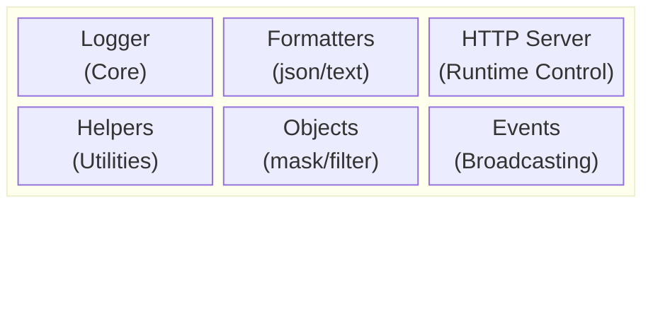
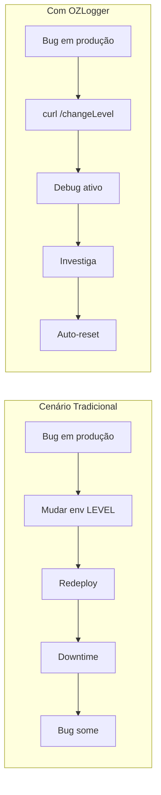
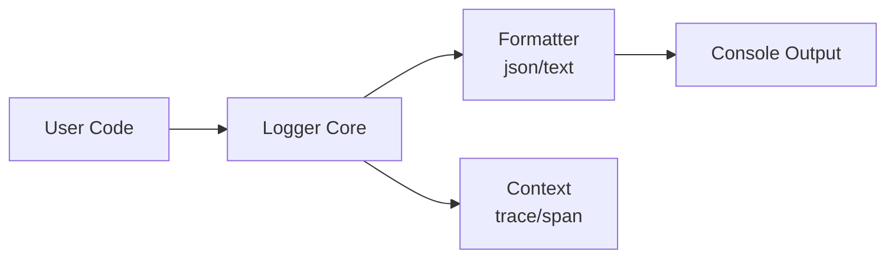
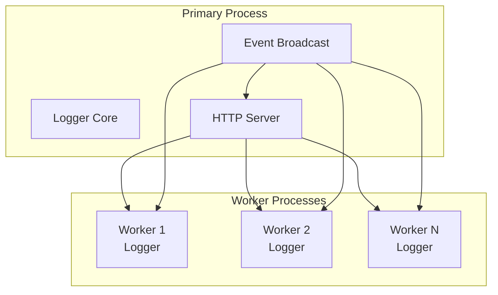
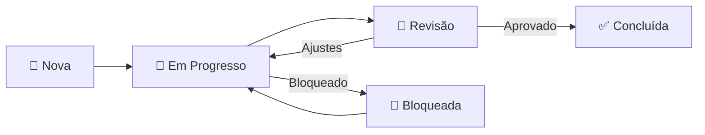

# Agents - OZLogger

Este documento descreve os agentes e componentes responsáveis por cada funcionalidade do módulo de logging OZLogger.

---

## Filosofia Core: Minimalismo Extremo

> **"Fazer o mínimo possível, com o menor footprint possível."**

O OZLogger segue o princípio de que um logger **não deve competir por recursos** com a aplicação. O foco é:

1. **Externalizar dados** - Apenas formatar e enviar para stdout/stderr
2. **Delegar transporte** - Coletores (Filebeat, Fluentd, Promtail) fazem o trabalho pesado
3. **Mínimo overhead** - Zero buffers, zero filas, zero conexões de rede
4. **Controle operacional** - Alterar nível em runtime com TTL obrigatório

### Impacto do Minimalismo

| Métrica | OZLogger | Loggers Tradicionais |
|---------|----------|----------------------|
| Memória base | ~2KB | 5-50MB |
| CPU por log | ~0.01ms | 0.1-5ms |
| Dependências | 1 | 10-50 |
| Conexões ativas | 0 | 1-10 |
| Goroutines/Threads | 0 | 2-10 |

---

## Visão Geral da Arquitetura

O OZLogger é composto por diversos agentes/componentes que trabalham em conjunto para fornecer uma solução de logging robusta, flexível e preparada para produção.



---

## Agentes e Componentes

### 1. Logger Core Agent (`lib/Logger.ts`)

**Responsabilidade:** Agente principal que gerencia todas as operações de logging.

**Funções:**
- Criação de instâncias de logger com tags personalizadas
- Configuração dinâmica de níveis de log
- Gerenciamento de timers para medição de tempo de execução
- Manutenção de contexto de logging (spanId, traceId)
- Integração com OpenTelemetry para distributed tracing

**Métodos expostos:**
| Método | Descrição |
|--------|-----------|
| `debug()` | Logs de depuração (severity: 5) |
| `info()` | Logs informativos (severity: 9) |
| `audit()` | Logs de auditoria (severity: 12) |
| `warn()` | Logs de aviso (severity: 13) |
| `error()` | Logs de erro (severity: 17) |
| `time()` | Inicia um timer para medição |
| `timeEnd()` | Finaliza timer e registra tempo |
| `withContext()` | Adiciona contexto ao logger |
| `getContext()` | Recupera contexto atual |

---

### 2. Format Agents (`lib/format/`)

**Responsabilidade:** Agentes responsáveis pela formatação da saída de logs.

#### 2.1 JSON Formatter (`lib/format/json.ts`)

**Função:** Formata logs em estrutura JSON compatível com OpenTelemetry.

**Campos de saída:**
```json
{
  "timestamp": "ISO8601",
  "tag": "string",
  "severityText": "DEBUG|INFO|AUDIT|WARNING|ERROR",
  "severityNumber": 1-21,
  "body": { "0": "message" },
  "traceId": "string",
  "spanId": "string",
  "pid": "number",
  "ppid": "number"
}
```

#### 2.2 Text Formatter (`lib/format/text.ts`)

**Função:** Formata logs em texto simples, ideal para desenvolvimento.

**Formato de saída:**
```
[timestamp][LEVEL] tag message
```

---

### 3. HTTP Server Agent (`lib/http/`)

**Responsabilidade:** Servidor HTTP embarcado para controle runtime do logger.

> **Importância Crítica:** Este componente permite debugging em produção sem redeploy, com garantia de reversão automática via TTL obrigatório.

#### Por que HTTP Server Embarcado?

O servidor HTTP existe para resolver um problema operacional crítico: **como debugar em produção sem reiniciar a aplicação?**



#### Características Minimalistas

| Aspecto | Implementação | Razão |
|---------|---------------|-------|
| Framework | `http` nativo | Zero dependências extras |
| Rotas | 1 única | Propósito único |
| Autenticação | Nenhuma | Firewall/localhost |
| Middleware | Nenhum | Menor overhead |
| Cluster | Singleton no primary | Evita conflitos |

#### 3.1 Server (`lib/http/server.ts`)

**Funções:**
- Inicializa servidor HTTP na porta configurada (default: 9898)
- Processa requisições para alteração de configurações
- Gerencia Content-Type e parsing de body
- Tratamento de erros HTTP padronizado
- **Não inicia em workers** - apenas no processo primário

**Configuração:**
- `OZLOGGER_SERVER` - Porta/endereço do servidor
- `OZLOGGER_HTTP="false"` - Desabilita o servidor

#### 3.2 Routes (`lib/http/routes/index.ts`)

**Rotas disponíveis:**

| Método | Rota | Descrição |
|--------|------|-----------|
| POST | `/changeLevel` | Altera o nível de log em runtime |

**Payload `/changeLevel`:**
```json
{
  "level": "debug|info|audit|warn|error",
  "duration": 60000
}
```

**Por que `duration` é obrigatório:**
1. **Segurança operacional** - Impede debug permanente acidental
2. **Auto-recovery** - Sistema volta ao normal automaticamente
3. **Auditabilidade** - Mudanças são sempre temporárias

#### 3.3 HttpError (`lib/http/errors.ts`)

**Função:** Classe de erro padronizada para respostas HTTP.

---

### 4. Event Agent (`lib/util/Events.ts`)

**Responsabilidade:** Sistema de eventos para comunicação entre processos.

**Funções:**
- `registerEvent()` - Registra handlers de eventos no processo
- `broadcastEvent()` - Transmite eventos para todos os workers (cluster mode)

**Eventos suportados:**
| Evento | Descrição |
|--------|-----------|
| `ozlogger.http.changeLevel` | Altera nível de log em todos os processos |

---

### 5. Helper Agents (`lib/util/Helpers.ts`)

**Responsabilidade:** Funções utilitárias usadas em todo o sistema.

**Funções disponíveis:**

| Função | Descrição |
|--------|-----------|
| `stringify()` | Converte dados para string formatada |
| `normalize()` | Normaliza dados para JSON |
| `colorized()` | Factory para colorização de output |
| `typeOf()` | Verificação precisa de tipos |
| `isJsonObject()` | Verifica se é objeto key/value |
| `isJsonArray()` | Verifica se é array |
| `level()` | Obtém nível de log configurado |
| `color()` | Verifica se colorização está ativa |
| `output()` | Obtém formato de saída configurado |
| `datetime()` | Closure para timestamp |
| `host()` | Parse de configuração do servidor |
| `getCircularReplacer()` | Tratamento de referências circulares |
| `getProcessInformation()` | Informações do processo atual |

---

### 6. Objects Agent (`lib/util/Objects.ts`)

**Responsabilidade:** Manipulação segura de objetos para logging.

**Funções:**

#### `mask(original, fields, char)`
Ofusca valores sensíveis em objetos usando hash SHA1.

```typescript
const data = { password: "secret123", user: "admin" };
const safe = mask(data, ["password"]);
// { password: "****************************************", user: "admin" }
```

#### `filter(original, fields)`
Remove campos de objetos recursivamente.

```typescript
const data = { password: "secret", user: "admin", email: "a@b.com" };
const safe = filter(data, ["password"]);
// { user: "admin", email: "a@b.com" }
```

---

## Enums e Constantes

### LogLevels (`lib/util/enum/LogLevels.ts`)
Define os níveis de severidade compatíveis com OpenTelemetry:

| Nível | Severidade | Status |
|-------|------------|--------|
| quiet | Infinity | Ativo |
| error | 17 | Ativo |
| warn | 13 | Ativo |
| audit | 12 | Ativo |
| info | 9 | Ativo |
| debug | 5 | Ativo |
| critical | 21 | Deprecated |
| http | 8 | Deprecated |
| silly | 1 | Deprecated |

### Outputs (`lib/util/enum/Outputs.ts`)
Formatos de saída suportados: `text`, `json`

### Colors (`lib/util/enum/Colors.ts`)
Códigos ANSI para colorização do terminal.

---

## Interfaces e Tipos

### LogContext (`lib/util/interface/LogContext.ts`)
```typescript
interface LogContext {
  attributes?: Record<string, unknown>;
  spanId: string;
  traceId: string;
}
```

### LoggerMethods (`lib/util/interface/LoggerMethods.ts`)
Interface que define todos os métodos públicos do Logger.

### AbstractLogger (`lib/util/type/AbstractLogger.ts`)
```typescript
type AbstractLogger = {
  log(arg: string): void;
};
```

### LogWrapper (`lib/util/type/LogWrapper.ts`)
Tipo da função wrapper que executa o logging efetivo.

---

## Fluxo de Execução



1. Código do usuário chama método de log (ex: `logger.info("message")`)
2. Logger Core verifica se o nível está habilitado
3. Se habilitado, coleta contexto (traceId, spanId, pid, etc.)
4. Formater apropriado (json/text) processa os dados
5. Output é enviado para o console ou logger customizado

---

## Comunicação Inter-Processos (Cluster Mode)



---

## Variáveis de Ambiente

| Variável | Descrição | Default |
|----------|-----------|---------|
| `OZLOGGER_LEVEL` | Nível mínimo de log | `audit` |
| `OZLOGGER_OUTPUT` | Formato de saída (`json`/`text`) | `json` |
| `OZLOGGER_COLORS` | Habilita cores no output | `false` |
| `OZLOGGER_DATETIME` | Inclui timestamp nos logs | `false` |
| `OZLOGGER_SERVER` | Porta/endereço do servidor HTTP | `9898` |
| `OZLOGGER_HTTP` | Habilita/desabilita servidor HTTP | `true` |

---

## Gerenciamento de Tasks

O OZLogger utiliza um sistema de tasks estruturado em `docs/tasks/` para rastrear melhorias, correções e trabalho pendente.

### Estrutura de Tasks

```
docs/tasks/
├── task-034-test-coverage/      # GitHub Issue #34
│   ├── Task.md        # Descrição da tarefa
│   ├── Context.md     # Contexto técnico e arquivos envolvidos
│   ├── Progress.md    # Status e histórico de progresso
│   └── Summary.md     # Resumo executivo
├── task-036-remove-deprecated/  # GitHub Issue #36
│   └── ...
└── task-NNN-.../                # NNN = GitHub Issue Number
    └── ...
```

### Arquivos Obrigatórios por Task

| Arquivo | Propósito |
|---------|-----------|
| `Task.md` | Descrição completa da tarefa, objetivo, critérios de aceitação |
| `Context.md` | Contexto técnico: arquivos afetados, dependências, código relevante |
| `Progress.md` | Histórico de progresso, checklist de subtarefas, status atual |
| `Summary.md` | Resumo executivo: impacto, prioridade, estimativa, decisões |

### Ciclo de Vida de uma Task



### Regras para Criação de Tasks

1. **Identificador único**: `task-NNN-nome-curto` onde NNN = número da issue no GitHub
2. **Criar issue primeiro**: `gh issue create --repo ozmap/ozlogger`
3. **Todos os 4 arquivos são obrigatórios**
4. **Progress.md deve ser atualizado a cada sessão de trabalho**
5. **Task.md é imutável após criação** (apenas correções menores)
6. **Summary.md deve refletir estado atual da task**

### Prioridades

| Emoji | Nível | Descrição |
|-------|-------|-----------|
| 🔴 | Crítico | Bloqueia deploy ou causa bugs em produção |
| 🟠 | Alto | Importante para próxima release |
| 🟡 | Médio | Melhoria desejável |
| 🟢 | Baixo | Nice to have |
| ⚪ | Backlog | Futuro indefinido |
