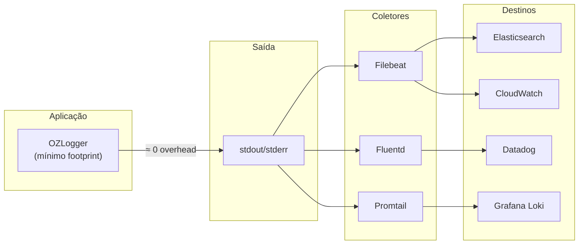
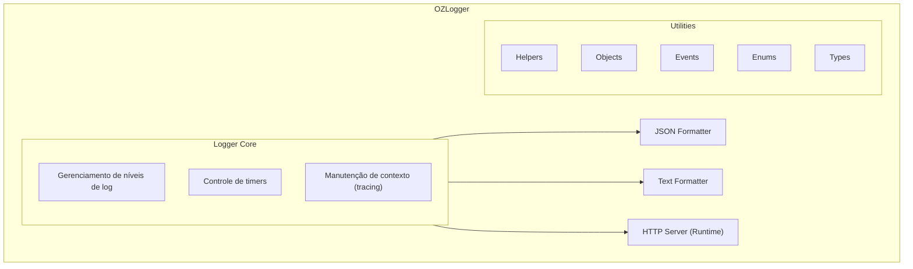

# OZLogger

[](https://opensource.org/licenses/MIT)

Módulo de logging profissional para Node.js desenvolvido pela DevOZ. Projetado para ambientes de produção com suporte a OpenTelemetry, saída JSON estruturada, colorização de terminal, e controle dinâmico de níveis de log via HTTP.

---

## Propósito e Filosofia

O OZLogger foi desenvolvido com o objetivo de **criar uma forma padronizada de auditoria** em aplicações Node.js, utilizando ferramentas e padrões da indústria como o **OpenTelemetry Data Model**.

### Princípio Fundamental: Minimalismo

> **"Garantir o log e auditoria básicos, com o menor footprint possível."**

O OZLogger foi projetado com uma filosofia clara: **ser o mais leve possível**, tanto em consumo de **memória** quanto de **CPU**. O foco é **apenas externalizar os dados** para stdout/stderr e deixar que os **coletores de logs** (Filebeat, Fluentd, Promtail, etc.) façam o trabalho pesado de transportar, processar e armazenar os logs.



### Por que Minimalismo?

| Aspecto | Abordagem OZLogger | Benefício |
|---------|-------------------|----------|
| **Memória** | Sem buffers internos, sem filas | Memória disponível para a aplicação |
| **CPU** | Zero processamento de transporte | CPU disponível para a aplicação |
| **I/O** | Apenas stdout síncrono | Sem conexões de rede, sem arquivos |
| **Dependências** | Mínimas (apenas @opentelemetry/api) | Menor bundle, menos vulnerabilidades |
| **Complexidade** | Delega transporte para coletores | Menos código = menos bugs |

### Controle de Nível em Runtime: Feature Crítica

Uma das features mais importantes do OZLogger é a capacidade de **alterar o nível de log em runtime** com **tempo de vida (TTL) obrigatório**:

```bash
# Ativa debug por 5 minutos em produção - sem redeploy!
curl -X POST http://localhost:9898/changeLevel \
  -H "Content-Type: application/json" \
  -d '{"level": "debug", "duration": 300000}'
```

**Por que isso é crítico?**

1. **Debug em produção sem redeploy** - Investigue problemas sem derrubar o serviço
2. **TTL obrigatório** - Impede que alguém esqueça o logger em modo debug
3. **Propagação automática em cluster** - Todos os workers mudam simultaneamente
4. **Zero downtime** - Mudança instantânea, reversão automática

### Principais Objetivos

- **Auditoria Padronizada** - Logs estruturados em formato JSON seguindo o padrão OpenTelemetry, permitindo integração com ferramentas de observabilidade como Elasticsearch, Datadog, Splunk, entre outras
- **Rastreabilidade** - Integração nativa com distributed tracing através de `traceId` e `spanId`, possibilitando correlacionar logs entre diferentes serviços
- **Compliance** - Nível `audit` dedicado para logs de auditoria, facilitando conformidade com requisitos regulatórios (LGPD, SOC2, etc.)
- **Segurança** - Funções `mask()` e `filter()` para garantir que dados sensíveis não vazem em logs
- **Operabilidade** - Controle dinâmico de níveis de log via HTTP, permitindo debugging em produção sem redeploy

### Compatibilidade com Ferramentas de Auditoria

A saída JSON do OZLogger é compatível com:

| Ferramenta | Integração |
|------------|------------|
| Elasticsearch/Kibana | Direta via Filebeat ou Logstash |
| Datadog | Via DD Agent ou API |
| Splunk | Via Universal Forwarder |
| AWS CloudWatch | Via CloudWatch Agent |
| Google Cloud Logging | Via Logging Agent |
| Grafana Loki | Via Promtail |

---

## Tabela de Conteúdos

- [Características](#características)
- [Instalação](#instalação)
- [Quick Start](#quick-start)
- [Arquitetura do Projeto](#arquitetura-do-projeto)
- [Estrutura de Arquivos](#estrutura-de-arquivos)
- [Níveis de Log](#níveis-de-log)
- [Métodos Disponíveis](#métodos-disponíveis)
- [Formatos de Saída](#formatos-de-saída)
- [Servidor HTTP Embarcado](#servidor-http-embarcado)
- [Contexto e Tracing](#contexto-e-tracing)
- [Utilitários](#utilitários)
- [Variáveis de Ambiente](#variáveis-de-ambiente)
- [Exemplos de Uso](#exemplos-de-uso)
- [Desenvolvimento](#desenvolvimento)
- [Testes](#testes)
- [Contribuindo](#contribuindo)
- [Documentação Adicional](#documentação-adicional)
- [Aviso de Deprecação](#-aviso-de-deprecação)

---

## Características

### Minimalismo e Performance

- **Zero overhead de transporte** - Apenas stdout, coletores fazem o resto
- **Mínimo footprint de memória** - Sem buffers, sem filas internas
- **Mínimo footprint de CPU** - Sem processamento de transporte
- **Dependências mínimas** - Apenas `@opentelemetry/api`

### Funcionalidades

- **Múltiplos níveis de log** - debug, info, audit, warn, error
- **Saída JSON estruturada** - Compatível com OpenTelemetry Data Model
- **Saída em texto** - Ideal para desenvolvimento local
- **Colorização** - Cores ANSI configuráveis para terminal
- **Servidor HTTP embarcado** - Altere níveis de log em runtime
- **Suporte a Cluster** - Broadcast de eventos entre workers
- **Integração OpenTelemetry** - traceId e spanId automáticos
- **Medição de tempo** - Métodos `time()` e `timeEnd()` integrados
- **Manipulação de dados sensíveis** - Funções `mask()` e `filter()`
- **Tratamento de referências circulares** - Serialização JSON segura
- **TypeScript nativo** - Tipagem completa incluída

### Controle Operacional

- **Alteração de nível em runtime** - Via HTTP sem redeploy
- **TTL obrigatório** - Reversão automática ao nível original
- **Cluster-aware** - Propagação automática para workers

---

## Instalação

O pacote é publicado no GitHub Packages, no escopo `@ozmap`. Mesmo quando o pacote está com visibilidade pública, o GitHub Packages exige autenticação para instalação via npm.

Crie ou atualize seu `~/.npmrc` com:

```ini
@ozmap:registry=https://npm.pkg.github.com
//npm.pkg.github.com/:_authToken=SEU_GITHUB_PAT_CLASSIC
```

O token precisa ter pelo menos o escopo `read:packages`.

Depois disso, instale normalmente:

```bash
npm install @ozmap/logger
```

ou com Yarn:

```bash
yarn add @ozmap/logger
```

ou com pnpm:

```bash
pnpm add @ozmap/logger
```

Se esta for a primeira publicação do pacote no GitHub Packages, deixe a visibilidade do package como pública na página do pacote dentro da organização `ozmap`.

---

## Publicação e Canais

O repositório usa GitHub Actions para publicar automaticamente no GitHub Packages, sempre no pacote `@ozmap/logger`.

### Canais publicados

| Origem | Tag npm | Objetivo |
|--------|---------|----------|
| `master` | `latest` | Release de produção |
| `develop` | `beta` | Release contínua de desenvolvimento |
| Pull Request com label `deployToTest` | `test` | Release efêmera para validação |

### Regras de publicação

- Push em `develop` publica uma nova versão com tag `beta`
- Push em `master` publica a versão estável com tag `latest`
- Pull Request só publica com tag `test` quando o label `deployToTest` estiver presente
- PR sem o label `deployToTest` não gera publicação de pacote
- PRs vindas de fork não publicam pacote, por segurança do workflow

### Como gerar novos deploys

#### Deploy de teste (`test`)

1. Abra ou atualize uma PR com origem no próprio repositório
2. Adicione o label `deployToTest`
3. Aguarde o workflow publicar a versão `test`
4. Para gerar um novo deploy de teste, faça novo push na PR

Se quiser forçar nova execução sem alterar código, remova o label `deployToTest` e adicione novamente.

#### Deploy beta (`beta`)

1. Faça merge ou push direto em `develop`
2. O workflow publica automaticamente uma nova versão com tag `beta`

#### Deploy de produção (`latest`)

1. Atualize o campo `version` no `package.json`
2. Faça merge em `master`
3. O workflow publica essa versão com tag `latest`

Se a mesma versão já existir no GitHub Packages, o workflow pula a publicação. Para um novo release de produção, a versão do `package.json` precisa ser incrementada.

### Versionamento gerado pelo workflow

- `latest` usa exatamente a versão definida no `package.json`
- `beta` usa a versão base com sufixo de build automático
- `test` usa a versão base com sufixo identificando PR e execução do workflow

Exemplos:

- `0.2.8` para `latest`
- `0.2.8-beta.145.1` para `beta`
- `0.2.8-pr.87.145.1` para `test`

### Como testar nas máquinas de desenvolvimento

Depois de configurar o `~/.npmrc`, os devs podem instalar qualquer canal explicitamente.

#### Instalar produção (`latest`)

```bash
npm install @ozmap/logger@latest
```

#### Instalar beta (`beta`)

```bash
npm install @ozmap/logger@beta
```

#### Instalar teste (`test`)

```bash
npm install @ozmap/logger@test
```

#### Verificar qual versão cada tag aponta

```bash
npm view @ozmap/logger dist-tags --registry=https://npm.pkg.github.com
```

#### Testar uma alteração local sem publicar

Para validar o pacote localmente antes de subir para o registry:

```bash
pnpm install
pnpm build
npm pack
```

Isso gera um tarball `.tgz` que pode ser instalado em outro projeto de teste:

```bash
npm install ../ozlogger/ozmap-logger-0.2.8.tgz
```

Esse fluxo é o mais rápido para validar build, tipagens e empacotamento sem depender do GitHub Actions.

---

## Quick Start

### TypeScript

```typescript
import createLogger from '@ozmap/logger';

const logger = createLogger('MeuApp');

logger.info('Aplicação iniciada');
logger.debug('Dados de debug', { userId: 123 });
logger.error('Erro encontrado', new Error('Falha na conexão'));
```

### JavaScript

```javascript
const createLogger = require('@ozmap/logger');

const logger = createLogger('MeuApp');

logger.info('Aplicação iniciada');
logger.debug('Dados de debug', { userId: 123 });
```

---

## Arquitetura do Projeto



---

## Estrutura de Arquivos

O projeto está organizado da seguinte forma:

```
ozlogger/
├── lib/                          # Código fonte principal
│   ├── index.ts                  # Ponto de entrada - exports
│   ├── Logger.ts                 # Classe principal do Logger
│   │
│   ├── format/                   # Formatadores de saída
│   │   ├── index.ts              # Factory de formatadores
│   │   ├── json.ts               # Formatador JSON estruturado
│   │   └── text.ts               # Formatador texto simples
│   │
│   ├── http/                     # Servidor HTTP embarcado
│   │   ├── server.ts             # Configuração do servidor
│   │   ├── errors.ts             # Classe HttpError
│   │   └── routes/
│   │       └── index.ts          # Rotas disponíveis
│   │
│   └── util/                     # Utilitários
│       ├── Events.ts             # Sistema de eventos
│       ├── Helpers.ts            # Funções auxiliares
│       ├── Objects.ts            # Manipulação de objetos
│       │
│       ├── enum/                 # Enumerações
│       │   ├── Colors.ts         # Códigos ANSI de cores
│       │   ├── LevelTags.ts      # Tags de níveis de log
│       │   ├── LogLevels.ts      # Níveis e severidades
│       │   └── Outputs.ts        # Tipos de saída
│       │
│       ├── interface/            # Interfaces TypeScript
│       │   ├── LogContext.ts     # Contexto de logging
│       │   ├── LoggerColorized.ts # Interface de colorização
│       │   └── LoggerMethods.ts  # Métodos do Logger
│       │
│       └── type/                 # Tipos TypeScript
│           ├── AbstractLogger.ts # Logger abstrato
│           ├── Event.ts          # Tipos de eventos
│           ├── Http.ts           # Tipos HTTP
│           └── LogWrapper.ts     # Wrapper de logging
│
├── tests/                        # Testes automatizados
│   ├── logger.test.ts            # Testes principais
│   ├── logger.perf.test.ts       # Testes de performance
│   └── utils.test.ts             # Testes de utilitários
│
├── dist/                         # Código compilado (gerado)
├── package.json                  # Configurações do pacote
├── tsconfig.json                 # Configurações TypeScript
├── jest.config.js                # Configurações de testes
├── Agents.md                     # Documentação dos agentes
└── README.md                     # Esta documentação
```

### Descrição dos Arquivos Principais

#### `lib/Logger.ts`
Classe principal que implementa toda a lógica de logging:
- Construtor que aceita tag, cliente de log customizado e opção de desabilitar servidor HTTP
- Métodos de log: `debug()`, `info()`, `audit()`, `warn()`, `error()`
- Métodos de timing: `time()`, `timeEnd()`
- Gerenciamento de contexto: `withContext()`, `getContext()`
- Configuração dinâmica de níveis via `configure()` e `changeLevel()`
- Factory function `createLogger()` para criação simplificada

#### `lib/format/json.ts`
Formatador que produz logs em JSON estruturado compatível com OpenTelemetry:
- Inclui `severityText`, `severityNumber`, `timestamp`, `body`
- Suporta `traceId` e `spanId` para distributed tracing
- Tratamento de referências circulares com `getCircularReplacer()`

#### `lib/format/text.ts`
Formatador para saída em texto simples:
- Formato: `[timestamp][LEVEL] tag mensagem`
- Ideal para leitura humana durante desenvolvimento

#### `lib/http/server.ts`
Servidor HTTP embarcado para controle runtime:
- Inicia apenas no processo primário (cluster-aware)
- Porta padrão: 9898
- Processa requisições JSON e text
- Tratamento de erros padronizado

#### `lib/http/routes/index.ts`
Rotas HTTP disponíveis:
- `POST /changeLevel` - Altera nível de log temporariamente

#### `lib/util/Events.ts`
Sistema de eventos para comunicação inter-processos:
- `registerEvent()` - Registra handlers no processo
- `broadcastEvent()` - Transmite para todos os workers

#### `lib/util/Helpers.ts`
Funções utilitárias diversas:
- `stringify()` / `normalize()` - Conversão de dados
- `colorized()` - Factory de colorização
- `level()`, `color()`, `output()` - Leitura de configuração
- `datetime()` - Geração de timestamps
- `host()` - Parse de configuração do servidor
- `getCircularReplacer()` - Tratamento de referências circulares

#### `lib/util/Objects.ts`
Manipulação segura de objetos para logging:
- `mask()` - Ofusca valores sensíveis (usa SHA1 hash)
- `filter()` - Remove campos especificados

---

## Níveis de Log

Os níveis seguem o modelo de severidade do OpenTelemetry:

| Nível | Severidade | Descrição |
|-------|------------|-----------|
| `quiet` | ∞ | Suprime todos os logs |
| `error` | 17 | Erros de aplicação |
| `warn` | 13 | Avisos importantes |
| `audit` | 12 | Logs de auditoria |
| `info` | 9 | Informações gerais |
| `debug` | 5 | Debugging detalhado |

Níveis deprecados (serão removidos em 0.3.x):
- `critical` (17) → use `error`
- `http` (8) → use `info`
- `silly` (1) → use `debug`

---

## Métodos Disponíveis

### Métodos de Logging

```typescript
logger.debug(...args: unknown[]): void  // Nível DEBUG
logger.info(...args: unknown[]): void   // Nível INFO
logger.audit(...args: unknown[]): void  // Nível AUDIT
logger.warn(...args: unknown[]): void   // Nível WARNING
logger.error(...args: unknown[]): void  // Nível ERROR
```

### Métodos de Timing

```typescript
logger.time(id: string): Logger         // Inicia timer
logger.timeEnd(id: string): Logger      // Finaliza timer e loga tempo

// Timing com nível específico
logger.debug.timeEnd(id: string)        // Loga no nível DEBUG
logger.error.timeEnd(id: string)        // Loga no nível ERROR
```

### Métodos de Contexto

```typescript
logger.withContext(ctx: LogContext): Logger  // Adiciona contexto
logger.getContext(): LogContext              // Recupera contexto atual
```

### Métodos de Controle

```typescript
logger.changeLevel(level: string): void  // Altera nível de log
logger.stop(): Promise<void>             // Para servidor HTTP
```

---

## Formatos de Saída

### JSON (Padrão)

```json
{
  "timestamp": "2024-01-15T10:30:00.000Z",
  "tag": "MeuApp",
  "severityText": "INFO",
  "severityNumber": 9,
  "body": {
    "0": "Mensagem de log",
    "1": { "dados": "adicionais" }
  },
  "traceId": "abc123...",
  "spanId": "def456...",
  "pid": 12345,
  "ppid": 12344
}
```

### Text

```
2024-01-15T10:30:00.000Z [INFO] MeuApp Mensagem de log { dados: "adicionais" }
```

---

## Servidor HTTP Embarcado

O logger inclui um servidor HTTP para controle runtime.

### Configuração

| Variável | Descrição | Padrão |
|----------|-----------|--------|
| `OZLOGGER_SERVER` | Porta/endereço | `9898` |
| `OZLOGGER_HTTP` | Habilita servidor | `true` |

Formatos de `OZLOGGER_SERVER`:
- `9898` - Apenas porta
- `:9898` - Apenas porta
- `localhost:9898` - Host e porta
- `127.0.0.1:9898` - IPv4 e porta
- `[::1]:9898` - IPv6 e porta

### Desabilitar Servidor

Via variável de ambiente:
```bash
OZLOGGER_HTTP="false"
```

Via código:
```typescript
const logger = createLogger('app', { noServer: true });
```

### Alterar Nível em Runtime

```bash
curl -X POST http://localhost:9898/changeLevel \
  -H "Content-Type: application/json" \
  -d '{"level": "debug", "duration": 300000}'
```

O nível retorna ao original após `duration` milissegundos.

---

## Contexto e Tracing

### OpenTelemetry Integration

O logger integra automaticamente com OpenTelemetry para distributed tracing:

```typescript
import { trace, context } from '@opentelemetry/api';

// TraceId e SpanId são adicionados automaticamente aos logs
// quando existe um span ativo no contexto
logger.info('Requisição processada');
```

### Contexto Manual

```typescript
logger.withContext({
  traceId: 'custom-trace-id',
  spanId: 'custom-span-id',
  attributes: {
    userId: 123,
    requestId: 'abc'
  }
});

logger.info('Log com contexto personalizado');
```

---

## Utilitários

### mask() - Ofuscar Dados Sensíveis

```typescript
import { mask } from '@ozmap/logger';

const dados = {
  usuario: 'admin',
  senha: 'secret123',
  apiKey: 'key123'
};

const seguro = mask(dados, ['senha', 'apiKey']);
// {
//   usuario: 'admin',
//   senha: '****************************************',
//   apiKey: '****************************************'
// }
```

### filter() - Remover Campos

```typescript
import { filter } from '@ozmap/logger';

const dados = {
  usuario: 'admin',
  senha: 'secret123',
  email: 'admin@example.com'
};

const seguro = filter(dados, ['senha']);
// {
//   usuario: 'admin',
//   email: 'admin@example.com'
// }
```

---

## Variáveis de Ambiente

| Variável | Descrição | Valores | Padrão |
|----------|-----------|---------|--------|
| `OZLOGGER_LEVEL` | Nível mínimo de log | `quiet`, `error`, `warn`, `audit`, `info`, `debug` | `audit` |
| `OZLOGGER_OUTPUT` | Formato de saída | `json`, `text` | `json` |
| `OZLOGGER_COLORS` | Colorização no terminal | `true`, `false` | `false` |
| `OZLOGGER_DATETIME` | Incluir timestamp | `true`, `false` | `false` |
| `OZLOGGER_SERVER` | Endereço do servidor HTTP | `[host]:port` | `9898` |
| `OZLOGGER_HTTP` | Habilitar servidor HTTP | `true`, `false` | `true` |

---

## Exemplos de Uso

----

## Available log methods
The available logging methods are presented in hierarchy level order.

 - `.debug(...messages: any[])`
 - `.info(...messages: any[])`
 - `.audit(...messages: any[])`
 - `.warn(...messages: any[])`
 - `.error(...messages: any[])`

There are also timing methods available:

 - `.time(id: string)`
 - `.timeEnd(id: string)`

## Usage examples
Here is a simple code snippet example of using it with typescript:

```typescript
import createLogger from '@ozmap/logger';

// Initialize and configure the logging facility
const logger = createLogger();

// Example of simple debug log
logger.debug("Simple test log");
```

Or if you are using it with javascript:

```javascript
const createLogger = require('@ozmap/logger');

// Initialize and configure the logging facility
const logger = createLogger();

// Example of simple debug log
logger.debug("Simple test log");
```

You can also use it to time operations:

```typescript
import createLogger from '@ozmap/logger';

// Initialize and configure the logging facility
const logger = createLogger();

// Example of timing an operation
logger.time("test-operation");

// ... some code here ...

logger.timeEnd("test-operation");
```

By default, timing logs are output at the `INFO` level, but you can change this by chaining the level method beforehand:

```typescript
import createLogger from '@ozmap/logger';

// Initialize and configure the logging facility
const logger = createLogger();

// Example of timing an operation with custom log level
logger.debug.time("test-operation");

// ... some code here ...

logger.debug.timeEnd("test-operation");
```


## HTTP server
The logger module also starts an HTTP server on port `9898` by default.
This server can be used to change the log level at runtime without having to restart your application.

The server can be disabled by setting the `OZLOGGER_HTTP="false"` environment variable.
Or passing it as an option when creating the logger itself.

```typescript
import createLogger from '@ozmap/logger';

// Initialize and configure the logging facility
const logger = createLogger({ noServer: true });
```


## Changing log levels

You can change log levels by setting the `OZLOGGER_LEVEL` environment variable on your deployment.

```bash
OZLOGGER_LEVEL="debug"
```

Or alternatively you can make an HTTP request to the logger's server to change the log level at runtime without restarting your application.

```text
POST http://localhost:9898/changeLevel
{
    "level": "<log-level>",
    "duration": <milliseconds>
}
```

```curl
curl -L -X POST -H 'Content-Type: application/json' -d '{"level":"<log-level>","duration":<milliseconds>}' http://localhost:9898/changeLevel
```

**IMPORTANT:** If you have disabled the HTTP server, you will not be able to change the log level at runtime.

When changing the log level at runtime, you must specify a duration (in milliseconds) for how long the new log level should be active. Afterwards, the log level will revert to the default level set in the environment variable `OZLOGGER_LEVEL` or to 'INFO' if not set.


## Logging during development

Since the logger module is primarily designed for production use and performance, it comes with non friendly defaults for development purposes.

Out of the box, the logger will output messages in a JSON format without colors or pretty printing.

It is recommended for **development only** purposes to set the `OZLOGGER_COLORS="true"` and `OZLOGGER_OUTPUT="text"` environment variables to enable colored and easier to read logs.

Another option that can be useful during development is to set the `OZLOGGER_DATETIME="true"` environment variable to enable timestamped logs.


## Logging during testing

When running tests, you can come across situations where the HTTP port `9898` is already in use by another instance of the logger module. Because of this, it is recommended to disable the HTTP server during tests by setting the `OZLOGGER_HTTP="false"` environment variable.

Besides that, if you want to avoid cluttering your test output with log messages, you can set the `OZLOGGER_LEVEL="quiet"` environment variable to suppress all log messages.

---

## Testes (Obrigatório)

**IMPORTANTE:** É obrigatório executar os testes e verificar a cobertura de código antes de enviar qualquer alteração.

### Executando os Testes

```bash
# Com npm
npm test

# Com yarn
yarn test

# Com pnpm
pnpm test

# Modo watch (desenvolvimento)
npm run test:watch
```

### Cobertura de Código

A cobertura de código é um requisito obrigatório para todas as contribuições. Execute:

```bash
# Executar testes com cobertura
npm test -- --coverage

# Com yarn
yarn test --coverage

# Com pnpm
pnpm test -- --coverage
```

### Configuração do Jest

O projeto utiliza Jest com a seguinte configuração:

```javascript
// jest.config.js
module.exports = {
    preset: 'ts-jest',
    testEnvironment: 'node',
    collectCoverageFrom: [
        'lib/**/*.ts',
        '!lib/**/*.d.ts'
    ],
    coverageThreshold: {
        global: {
            branches: 80,
            functions: 80,
            lines: 80,
            statements: 80
        }
    }
};
```

### Variáveis de Ambiente para Testes

```bash
# Recomendado para testes
OZLOGGER_HTTP="false"    # Desabilita servidor HTTP
OZLOGGER_LEVEL="quiet"   # Suprime todos os logs
```

### Estrutura dos Testes

```
tests/
├── logger.test.ts       # Testes da classe Logger
├── logger.perf.test.ts  # Testes de performance
└── utils.test.ts        # Testes dos utilitários (mask, filter)
```

### Requisitos para Pull Requests

- [ ] Todos os testes existentes devem passar
- [ ] Novos recursos devem ter testes correspondentes
- [ ] Cobertura de código não pode diminuir
- [ ] Testes devem ser executados com `OZLOGGER_HTTP=false`

---

## Contribuindo

### Pré-requisitos

- Node.js 20+
- npm, yarn ou pnpm

### Configuração do Ambiente

```bash
# Clonar repositório
git clone https://github.com/ozmap/ozlogger.git
cd ozlogger

# Instalar dependências
npm install  # ou yarn ou pnpm install

# Executar build
npm run build

# Executar testes
npm test
```

### Scripts Disponíveis

| Script | Descrição |
|--------|-----------|
| `npm run build` | Compila TypeScript |
| `npm run build:watch` | Compila em modo watch |
| `npm run test` | Executa testes |
| `npm run test:watch` | Testes em modo watch |
| `npm run lint` | Executa linter |
| `npm run format` | Formata código com Prettier |

### Fluxo de Contribuição

1. Fork o repositório
2. Crie uma branch (`git checkout -b feature/nova-funcionalidade`)
3. Faça suas alterações
4. Execute os testes (`npm test -- --coverage`)
5. Commit suas mudanças (`git commit -m 'feat: adiciona nova funcionalidade'`)
6. Push para a branch (`git push origin feature/nova-funcionalidade`)
7. Abra um Pull Request

---

## Documentação Adicional

Para informações mais detalhadas, consulte:

- [Quick Guide](docs/QUICK-GUIDE.md) - Guia rápido com exemplos práticos
- [Arquitetura](docs/ARCHITECTURE.md) - Detalhes da arquitetura interna
- [Análise: Sistema HTTP](docs/ANALYSIS-HTTP-SYSTEM.md) - Análise profunda do servidor HTTP
- [Análise: Process Hang](docs/ANALYSIS-PROCESS-HANG.md) - Análise técnica do problema de processo pendurado
- [Melhorias](docs/IMPROVEMENTS.md) - Lista de melhorias planejadas
- [Problemas Conhecidos](docs/ISSUES.md) - Issues e workarounds
- [Agents](Agents.md) - Descrição dos agentes/componentes

