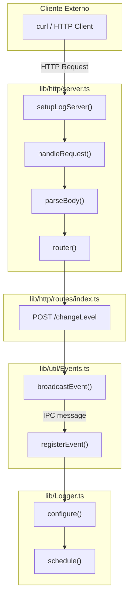
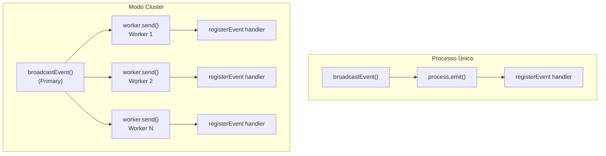
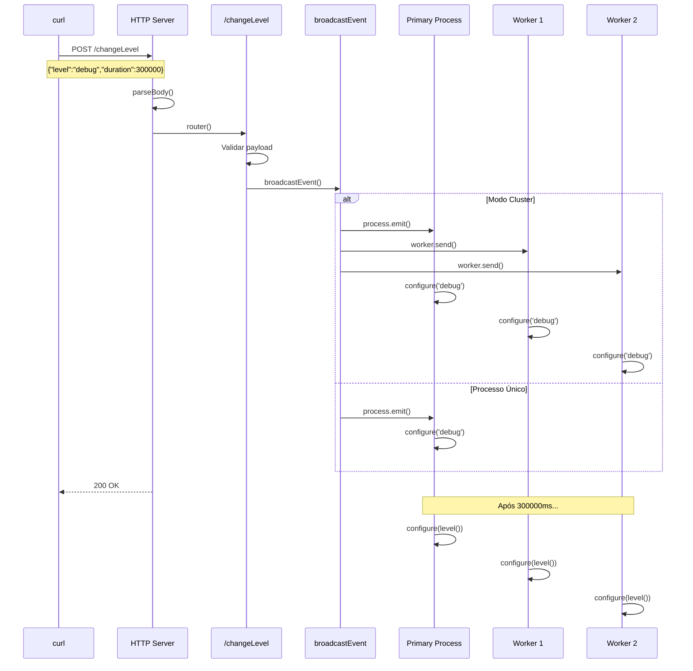

# Análise do Sistema HTTP - OZLogger

## Visão Geral

O OZLogger inclui um servidor HTTP embarcado minimalista para controle runtime. Este documento analisa em profundidade a arquitetura, fluxo de dados e decisões de design.

---

## Arquitetura HTTP



---

## Componentes

### 1. Server (`lib/http/server.ts`)

#### `setupLogServer(port, address)`

**Responsabilidade:** Inicializa o servidor HTTP no processo primário.

**Características de baixo footprint:**
- Usa `http` nativo do Node.js (sem Express, Fastify, etc.)
- Zero dependências externas
- Apenas um servidor por cluster (não inicia em workers)
- Singleton via variável de ambiente `OZLOGGER_HTTP`

```typescript
export function setupLogServer<TScope extends Logger>(
    this: TScope,
    port: number,
    address: string
): Server | void {
    // Não inicia em workers - economiza recursos
    if (cluster.isWorker) return;
    
    // Singleton - evita múltiplos servidores
    if (process.env.OZLOGGER_HTTP?.match(/false/i)) return;
    process.env.OZLOGGER_HTTP = 'false';
    
    // HTTP nativo - zero overhead de frameworks
    return http
        .createServer(handleRequest.call(this))
        .listen(port, address, () => {
            this.info(`Log server started listening at ${address}:${port}`);
        });
}
```

**Decisões de design minimalista:**
| Aspecto | Decisão | Razão |
|---------|---------|-------|
| Framework | `http` nativo | Zero dependências, menor bundle |
| Workers | Não iniciam servidor | Economia de recursos |
| Múltiplas instâncias | Singleton | Evita conflitos e overhead |
| Porta padrão | 9898 | Não conflita com serviços comuns |

#### `handleRequest()`

**Responsabilidade:** Closure que processa requisições HTTP.

```typescript
function handleRequest<TScope extends Logger>(
    this: TScope
): (req: IncomingMessage, res: ServerResponse) => Promise<ServerResponse> {
    return async (req, res) => {
        // Detecta Content-Type e Accept
        const reqIsJson = isContentTypeJson(req.headers);
        const resIsJson = isAcceptTypeJson(req.headers);
        
        // Parse body apenas para não-GET
        if (req.method !== 'GET') {
            await parseBody(req, reqIsJson ? 'json' : 'text');
        }
        
        // Roteamento simples
        return router(req as ProcessedRequest, res);
    };
}
```

**Características:**
- Closure para manter contexto do Logger
- Parse condicional (só quando necessário)
- Detecção automática de JSON

#### `parseBody(req, type)`

**Responsabilidade:** Processa o corpo da requisição com limite de tamanho.

```typescript
async function parseBody<T extends IncomingMessage>(
    req: T,
    type: string
): Promise<void> {
    const data: Buffer[] = [];
    
    for await (const chunk of req) {
        data.push(chunk as Buffer);
        
        // Limite de 5MB - proteção contra DoS
        if (limit(Buffer.concat(data), 5)) {
            req.socket.destroy();
            throw new HttpError('Content too large', 413);
        }
    }
    
    // Parse JSON ou texto
    Object.assign(req, {
        body: type === 'json'
            ? JSON.parse(Buffer.concat(data).toString())
            : Buffer.concat(data).toString()
    });
}
```

**Decisões de segurança:**
- Limite de 5MB por requisição
- Destruição do socket em caso de payload grande
- Validação de JSON antes de processar

#### `router(req, res)`

**Responsabilidade:** Roteamento minimalista baseado em objeto.

```typescript
async function router<REQ, RES>(req: REQ, res: RES): Promise<RES> {
    const route = `${req.method} ${req.url}`;
    
    // Lookup O(1) em objeto
    if (!(route in routes)) throw new HttpError('Not found', 404);
    
    await routes[route](req, res);
    
    return res.writeHead(200).end();
}
```

**Características minimalistas:**
- Sem regex ou pattern matching complexo
- Lookup O(1) via objeto JavaScript
- Sem middleware chain

---

### 2. Routes (`lib/http/routes/index.ts`)

#### `POST /changeLevel`

**Responsabilidade:** Altera o nível de log em runtime com TTL.

```typescript
export default {
    'POST /changeLevel': async (req, res) => {
        // Validações rigorosas
        if (!req.reqIsJson)
            throw new HttpError(`Request content must be of type JSON.`, 409);
        
        if (!isJsonObject(req.body))
            throw new HttpError(`Invalid request payload.`, 409);
        
        const data = req.body as Record<string, unknown>;
        
        // Validação de parâmetros
        if (!('level' in data))
            throw new HttpError(`Missing 'level' parameter.`, 409);
        
        if (!('duration' in data))
            throw new HttpError(`Missing 'duration' parameter.`, 409);
        
        if (typeof data.duration !== 'number' || data.duration < 1)
            throw new HttpError(`'duration' must be positive integer.`, 409);
        
        // Broadcast para todos os processos
        broadcastEvent('ozlogger.http.changeLevel', data);
    }
}
```

**Payload esperado:**
```json
{
    "level": "debug",
    "duration": 300000
}
```

**Por que `duration` é obrigatório:**
- Evita esquecer o logger em modo debug
- Garante retorno automático ao nível de produção
- Segurança operacional em produção

---

### 3. Events (`lib/util/Events.ts`)

#### `broadcastEvent(event, data)`

**Responsabilidade:** Propaga eventos para todos os processos do cluster.

```typescript
export function broadcastEvent(event: string, data: EventData = {}): void {
    const payload = { ...data, event } as unknown as NodeJS.Signals;
    
    if (!process.send) {
        // Aplicação não-cluster: emite localmente
        process.emit('message' as NodeJS.Signals, payload);
    } else {
        // Cluster: envia para todos os workers
        if (cluster.isWorker) return;
        
        for (const worker of Object.values(cluster.workers ?? {})) {
            worker?.send(payload);
        }
    }
}
```

**Fluxos:**



#### `registerEvent(context, event, handler)`

**Responsabilidade:** Registra handler para eventos IPC.

```typescript
export function registerEvent(
    context: Logger,
    event: string,
    handler: EventHandler
): void {
    process.on('message', (data: EventData) => {
        if ('event' in data && data.event === event)
            handler.bind(context)(data);
    });
}
```

---

### 4. Erros (`lib/http/errors.ts`)

#### `HttpError`

**Responsabilidade:** Erro padronizado para respostas HTTP.

```typescript
export class HttpError extends Error {
    public message: string;
    public code: number;
    
    public respond<RES>(res: ServerResponse, isJson: boolean): RES {
        return res
            .writeHead(this.code)
            .end(isJson 
                ? JSON.stringify({ message: this.message })
                : this.message
            );
    }
}
```

**Códigos usados:**
| Código | Situação |
|--------|----------|
| 404 | Rota não encontrada |
| 409 | Validação de payload falhou |
| 413 | Payload muito grande (>5MB) |
| 422 | JSON inválido |
| 500 | Erro interno |

---

## Fluxo Completo de `changeLevel`



---

## Integração com Logger

O Logger registra o handler no construtor:

```typescript
public constructor(opts = {}) {
    // ... setup ...
    
    registerEvent(
        this,
        'ozlogger.http.changeLevel',
        (data: { level, duration }) => {
            // 1. Muda nível imediatamente
            this.configure(data.level);
            
            // 2. Agenda reset após duration
            this.schedule(
                data.event,
                () => this.configure(level()),  // Volta ao nível do env
                data.duration
            );
        }
    );
}
```

O método `schedule()` gerencia timeouts:

```typescript
private schedule(id: string, callback: () => void, duration?: number): void {
    // Cancela timeout anterior se existir
    if (this.timeouts.has(id)) clearTimeout(this.timeouts.get(id));
    
    // Cria novo timeout
    this.timeouts.set(
        id,
        setTimeout(() => {
            callback();
            this.timeouts.delete(id);
        }, duration)
    );
}
```

---

## Características de Baixo Footprint

### Memória

| Aspecto | Implementação | Impacto |
|---------|---------------|---------|
| Servidor | `http` nativo | ~2KB de overhead |
| Rotas | Objeto simples | O(1) lookup |
| Parsing | Streaming com limite | Max 5MB buffer |
| Eventos | IPC nativo | Zero alocação extra |

### CPU

| Aspecto | Implementação | Impacto |
|---------|---------------|---------|
| Framework | Nenhum | Zero middleware overhead |
| Roteamento | Lookup direto | O(1) |
| Validação | Checks simples | Minimal |
| Serialização | JSON nativo | Otimizado pelo V8 |

### Rede

| Aspecto | Implementação | Impacto |
|---------|---------------|---------|
| Protocolo | HTTP/1.1 | Mínimo overhead |
| Keep-alive | Não configurado | Conexões fecham após uso |
| Compressão | Nenhuma | Payloads pequenos |

---

## Segurança

### Proteções Implementadas

1. **Limite de payload** (5MB) - Previne DoS via body grande
2. **Validação de tipos** - Rejeita payloads malformados
3. **Singleton** - Evita múltiplos servidores expostos
4. **Duration obrigatório** - Impede debug permanente acidental

### Considerações

- Servidor não tem autenticação (recomenda-se firewall)
- Listening em localhost por padrão (seguro)
- Não expõe dados sensíveis

---

## Extensibilidade

### Adicionar Nova Rota

```typescript
// lib/http/routes/index.ts
export default {
    'POST /changeLevel': async (req, res) => { /* ... */ },
    
    // Nova rota
    'GET /status': async (req, res) => {
        res.setHeader('Content-Type', 'application/json');
        res.write(JSON.stringify({ status: 'ok' }));
    },
    
    'POST /flush': async (req, res) => {
        // Implementar flush de buffers
    }
}
```

### Adicionar Middleware (não recomendado)

O design atual é intencionalmente sem middlewares para manter o footprint mínimo. Se necessário, modificar `handleRequest()`.

---

## Comparação com Alternativas

| Aspecto | OZLogger HTTP | Express | Fastify |
|---------|---------------|---------|---------|
| Dependências | 0 | 30+ | 15+ |
| Bundle size | ~5KB | ~500KB | ~200KB |
| Startup time | <1ms | ~50ms | ~20ms |
| Memory overhead | ~2KB | ~10MB | ~5MB |
| Throughput | N/A | N/A | N/A |

> OZLogger não compete em throughput porque o servidor é apenas para controle, não para tráfego de produção.

---

## Conclusão

O sistema HTTP do OZLogger segue a filosofia de **minimalismo extremo**:

- **Zero dependências** - Apenas APIs nativas do Node.js
- **Single purpose** - Apenas uma rota, uma função
- **Cluster-aware** - Funciona transparentemente em cluster
- **Auto-reset** - Mudanças são temporárias por design
- **Seguro por padrão** - localhost, limites, validações

O resultado é um sistema de controle runtime com overhead insignificante que não compete com os recursos da aplicação principal.
