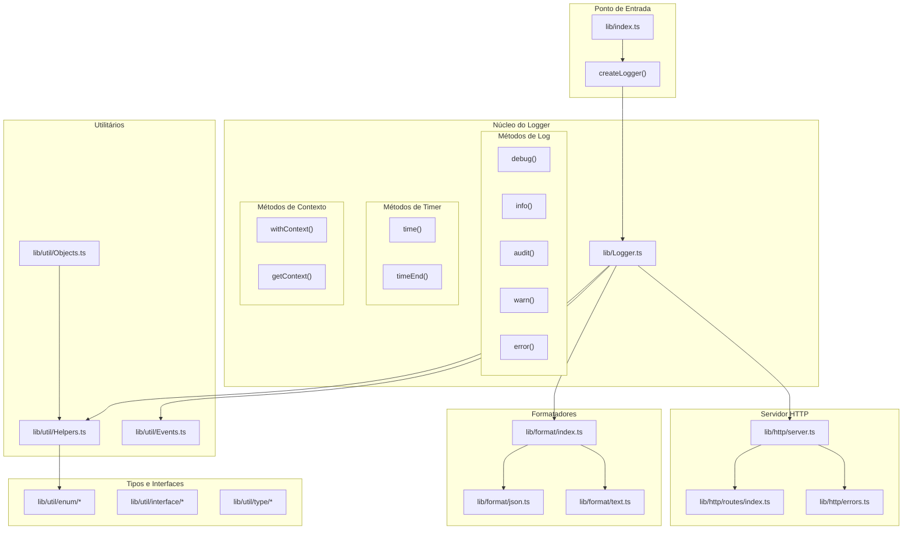
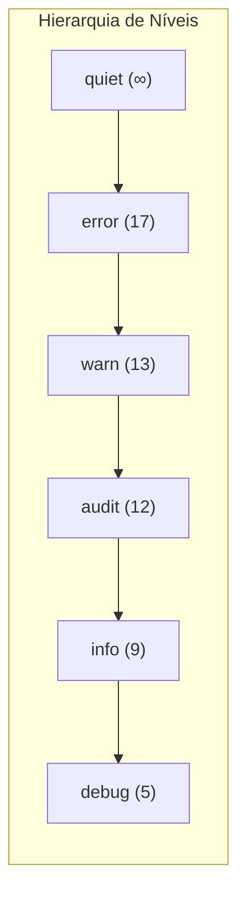
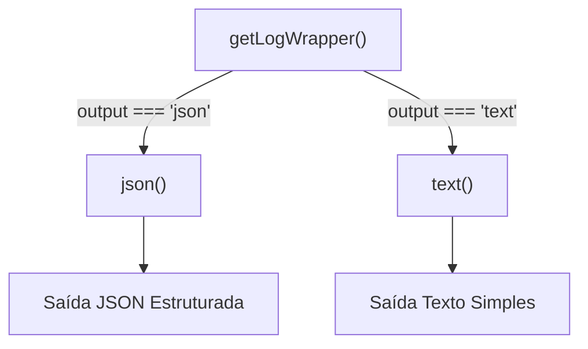
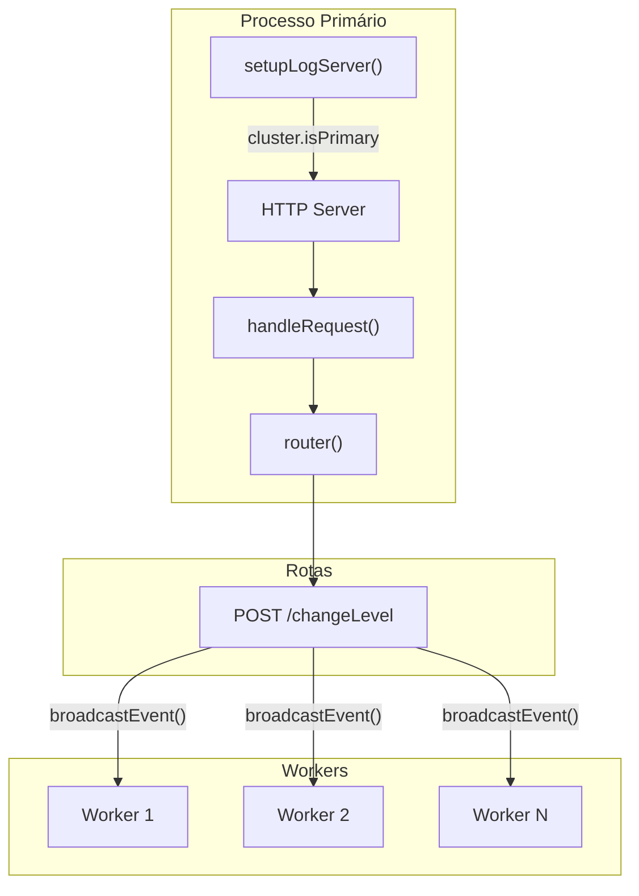
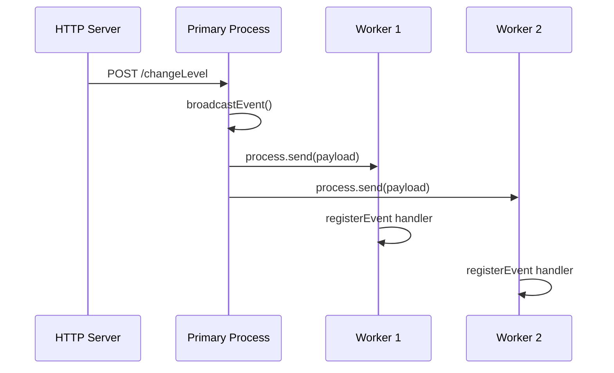
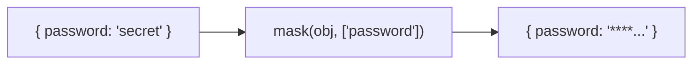
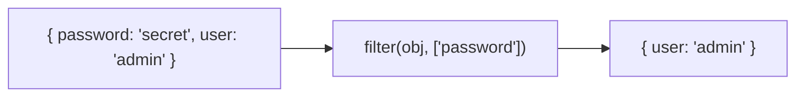
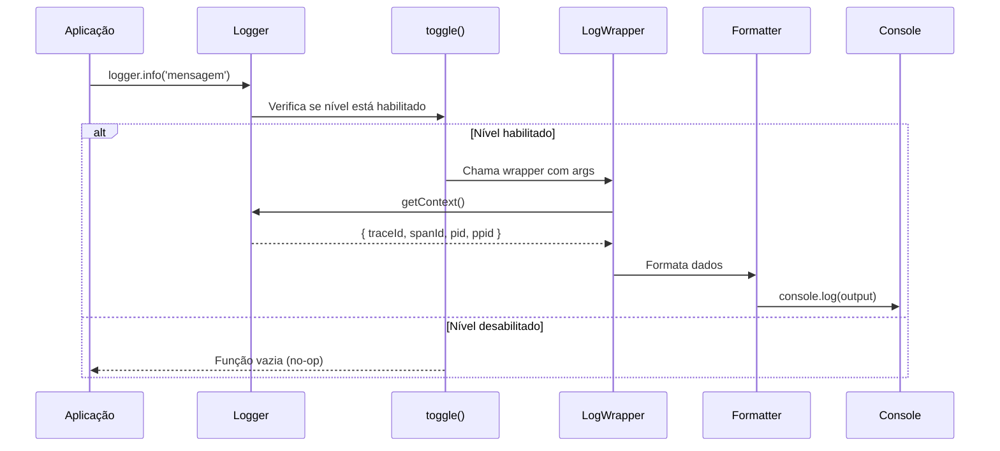
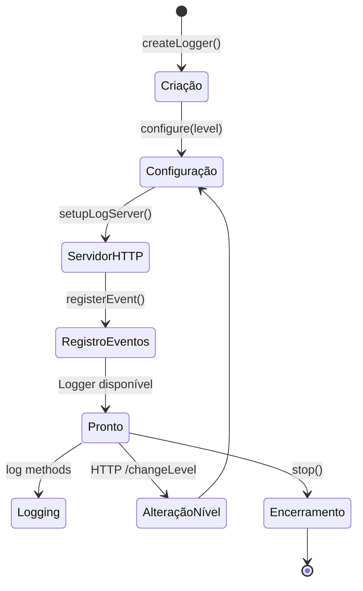
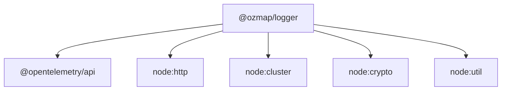

# Arquitetura do OZLogger

Este documento descreve em detalhes a arquitetura interna do módulo OZLogger, explicando como cada componente funciona e como eles se comunicam entre si.

---

## Visão Geral

O OZLogger é um módulo de logging profissional para Node.js que segue os princípios de:

- **Separação de responsabilidades** - Cada componente tem uma função específica
- **Extensibilidade** - Fácil adicionar novos formatadores ou transportes
- **Performance** - Otimizado para ambientes de produção
- **Observabilidade** - Integração nativa com OpenTelemetry

---

## Diagrama de Arquitetura



---

## Componentes Principais

### 1. Ponto de Entrada (`lib/index.ts`)

O arquivo de entrada exporta:

- `createLogger` - Factory function principal (default export)
- `Logger` - Classe do logger para uso avançado
- `mask` - Função para mascaramento de dados sensíveis
- `filter` - Função para filtragem de campos

```typescript
// Exports disponíveis
import createLogger from '@ozmap/logger';           // Factory
import { Logger, mask, filter } from '@ozmap/logger'; // Named exports
```

### 2. Núcleo do Logger (`lib/Logger.ts`)

A classe `Logger` é o coração do sistema, responsável por:

#### 2.1 Gerenciamento de Estado

```typescript
class Logger {
    private timers = new Map<string, number>();      // Armazenamento de timers
    private timeouts = new Map<string, NodeJS.Timeout>(); // Timeouts agendados
    protected logger: LogWrapper;                    // Wrapper de formatação
    public server: Server | void;                    // Servidor HTTP
    private context: LogContext;                     // Contexto de tracing
}
```

#### 2.2 Configuração Dinâmica

O método `configure()` habilita/desabilita métodos de log baseado no nível configurado:



Se o nível configurado é `audit` (12), apenas métodos com severidade >= 12 são habilitados:
- ✅ `error()` (17)
- ✅ `warn()` (13)
- ✅ `audit()` (12)
- ❌ `info()` (9)
- ❌ `debug()` (5)

#### 2.3 Integração com OpenTelemetry

O método `getContext()` automaticamente extrai `traceId` e `spanId` do contexto OpenTelemetry ativo:

```typescript
public getContext(): LogContext {
    const span = trace.getSpan(context.active())?.spanContext();
    // Adiciona traceId e spanId se disponíveis
}
```

### 3. Sistema de Formatação (`lib/format/`)

#### 3.1 Factory de Formatadores (`lib/format/index.ts`)



#### 3.2 Formatador JSON (`lib/format/json.ts`)

Produz saída compatível com OpenTelemetry Data Model:

```json
{
    "timestamp": "2024-01-15T10:30:00.000Z",
    "tag": "MeuApp",
    "severityText": "INFO",
    "severityNumber": 9,
    "body": { "0": "mensagem", "1": { "dados": "extras" } },
    "traceId": "abc123...",
    "spanId": "def456...",
    "pid": 12345,
    "ppid": 12344
}
```

**Características:**
- Serialização segura com tratamento de referências circulares
- Normalização de tipos não-JSON (Error, Date, RegExp, etc.)
- Campos deprecados para retrocompatibilidade (`data`, `level`)

#### 3.3 Formatador Texto (`lib/format/text.ts`)

Produz saída legível para humanos:

```
2024-01-15T10:30:00.000Z [INFO] MeuApp mensagem { dados: "extras" }
```

**Características:**
- Formatação com `util.format()` para objetos
- Suporte a colorização ANSI
- Timestamp opcional

### 4. Servidor HTTP (`lib/http/`)

#### 4.1 Arquitetura do Servidor



#### 4.2 Fluxo de Requisição

1. **Recebimento** - `handleRequest()` recebe a requisição HTTP
2. **Parsing** - `parseBody()` processa o corpo (JSON ou texto)
3. **Roteamento** - `router()` direciona para o handler correto
4. **Execução** - Handler processa a requisição
5. **Broadcast** - Evento é propagado para todos os workers

#### 4.3 Tratamento de Erros

A classe `HttpError` padroniza respostas de erro:

```typescript
class HttpError extends Error {
    respond(res: ServerResponse, isJson: boolean): ServerResponse
}
```

### 5. Sistema de Eventos (`lib/util/Events.ts`)

#### 5.1 Comunicação Inter-Processos



#### 5.2 Funções Disponíveis

- `registerEvent(context, event, handler)` - Registra listener no processo
- `broadcastEvent(event, data)` - Propaga evento para todos os workers

### 6. Utilitários (`lib/util/`)

#### 6.1 Helpers (`lib/util/Helpers.ts`)

| Função | Descrição | Uso |
|--------|-----------|-----|
| `stringify()` | Converte para string formatada | Formatador text |
| `normalize()` | Normaliza para JSON | Formatador json |
| `colorized()` | Factory de colorização | Ambos formatadores |
| `typeOf()` | Detecção precisa de tipo | Validações |
| `isJsonObject()` | Verifica se é objeto | Validações |
| `isJsonArray()` | Verifica se é array | Validações |
| `level()` | Lê nível de env | Configuração |
| `color()` | Lê colorização de env | Configuração |
| `output()` | Lê formato de env | Configuração |
| `datetime()` | Closure para timestamp | Formatadores |
| `host()` | Parse de endereço | Servidor HTTP |
| `getCircularReplacer()` | Trata referências circulares | Formatador json |
| `getProcessInformation()` | Retorna pid/ppid | Contexto |

#### 6.2 Objects (`lib/util/Objects.ts`)

**mask()** - Ofusca valores sensíveis:



**filter()** - Remove campos:



---

## Fluxo de Execução de um Log



---

## Ciclo de Vida do Logger



---

## Considerações de Performance

### Otimizações Implementadas

1. **Métodos desabilitados são no-op** - Não há overhead quando um nível está desabilitado
2. **Lookup tables em mask/filter** - O(1) para verificar campos
3. **Lazy evaluation de contexto** - Contexto só é coletado quando necessário
4. **Singleton do servidor HTTP** - Apenas um servidor por cluster

### Recomendações

- Use `quiet` em testes para eliminar overhead de I/O
- Em produção, use nível `audit` ou superior
- Desabilite colorização em produção (`OZLOGGER_COLORS=false`)
- Use formatador JSON em produção para parsing automatizado

---

## Extensibilidade

### Adicionar Novo Formatador

1. Criar arquivo em `lib/format/novo-format.ts`
2. Implementar função que retorna `LogWrapper`
3. Registrar no switch de `lib/format/index.ts`
4. Adicionar novo valor em `lib/util/enum/Outputs.ts`

### Adicionar Nova Rota HTTP

1. Adicionar entrada em `lib/http/routes/index.ts`
2. Implementar handler assíncrono
3. Usar `broadcastEvent()` se necessário propagar para workers

---

## Dependências



- **@opentelemetry/api** - Integração com distributed tracing
- **node:http** - Servidor HTTP embarcado
- **node:cluster** - Suporte a modo cluster
- **node:crypto** - Hashing para mascaramento
- **node:util** - Formatação de objetos
