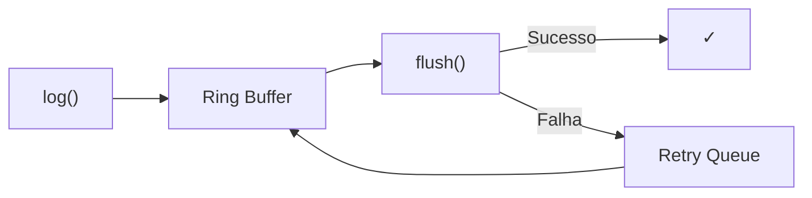
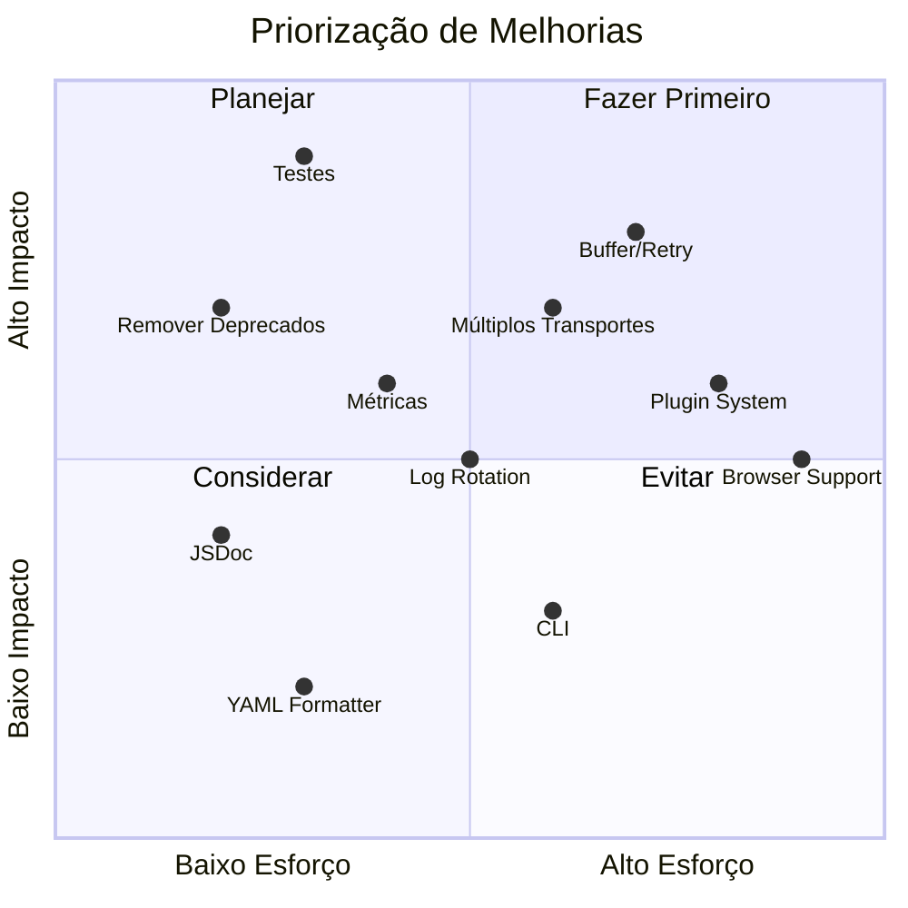

# Melhorias Sugeridas - OZLogger

Este documento lista melhorias potenciais para o módulo OZLogger, organizadas por prioridade e área de impacto.

---

## Sumário

- [Alta Prioridade](#alta-prioridade)
- [Média Prioridade](#média-prioridade)
- [Baixa Prioridade](#baixa-prioridade)
- [Melhorias de Longo Prazo](#melhorias-de-longo-prazo)

---

## Alta Prioridade

### 1. Adicionar Cobertura de Testes

**Status:** 🔴 Crítico

**Descrição:** A cobertura de testes atual não inclui todos os cenários críticos. É necessário expandir os testes para garantir maior confiabilidade.

**Arquivos afetados:**
- `tests/logger.test.ts`
- `tests/utils.test.ts`

**Cenários faltantes:**
- [ ] Testes de integração com OpenTelemetry
- [ ] Testes do servidor HTTP (rotas, erros, parsing)
- [ ] Testes de comunicação cluster (eventos)
- [ ] Testes de edge cases no formatador JSON (circular refs, tipos especiais)
- [ ] Testes de performance/benchmark
- [ ] Testes de configuração via variáveis de ambiente

**Implementação sugerida:**
```typescript
// Exemplo: Teste de servidor HTTP
describe('HTTP Server', () => {
    test('POST /changeLevel should change log level', async () => {
        const response = await fetch('http://localhost:9898/changeLevel', {
            method: 'POST',
            headers: { 'Content-Type': 'application/json' },
            body: JSON.stringify({ level: 'debug', duration: 5000 })
        });
        expect(response.status).toBe(200);
    });
});
```

---

### 2. Remover Campos e Métodos Deprecados

**Status:** 🟡 Planejado para v0.3.x

**Descrição:** Limpar código legado para reduzir complexidade e tamanho do bundle.

**Itens a remover:**
- Métodos: `silly()`, `http()`, `critical()`, `tag()`, `Logger.init()`
- Campos JSON: `data`, `level`
- Níveis: `silly`, `http`, `critical`

**Arquivos afetados:**
- `lib/Logger.ts`
- `lib/format/json.ts`
- `lib/util/enum/LogLevels.ts`
- `lib/util/enum/LevelTags.ts`

**Impacto:**
- Redução de ~15% no tamanho do código
- Simplificação da interface pública
- Breaking change para usuários que ainda usam métodos deprecados

---

### 3. Implementar Retry e Buffer para Logs

**Status:** 🔴 Não implementado

**Descrição:** Em cenários de alta carga, logs podem ser perdidos. Implementar um buffer com retry melhoraria a confiabilidade.

**Proposta de implementação:**



**Benefícios:**
- Zero perda de logs em picos de carga
- Backpressure handling
- Graceful degradation

---

## Média Prioridade

### 4. Adicionar Suporte a Múltiplos Transportes

**Status:** 🟡 Planejado

**Descrição:** Permitir envio de logs para múltiplos destinos simultaneamente (console, arquivo, serviço remoto).

**Arquivos a criar:**
- `lib/transport/index.ts`
- `lib/transport/console.ts`
- `lib/transport/file.ts`
- `lib/transport/http.ts`

**API proposta:**
```typescript
const logger = createLogger('app', {
    transports: [
        new ConsoleTransport(),
        new FileTransport({ path: '/var/log/app.log' }),
        new HttpTransport({ url: 'https://logs.example.com' })
    ]
});
```

---

### 5. Implementar Log Rotation

**Status:** 🔴 Não implementado

**Descrição:** Para transporte de arquivo, implementar rotação automática baseada em tamanho ou tempo.

**Configurações propostas:**
```typescript
new FileTransport({
    path: '/var/log/app.log',
    maxSize: '10MB',
    maxFiles: 5,
    compress: true
});
```

---

### 6. Adicionar Métricas Internas

**Status:** 🔴 Não implementado

**Descrição:** Expor métricas sobre o próprio logger para observabilidade.

**Métricas propostas:**
- `ozlogger_logs_total` - Total de logs por nível
- `ozlogger_logs_dropped` - Logs descartados
- `ozlogger_buffer_size` - Tamanho atual do buffer
- `ozlogger_format_duration_ms` - Tempo de formatação

**Implementação:**
```typescript
logger.getMetrics();
// { logs: { debug: 1000, info: 5000, ... }, dropped: 0, ... }
```

---

### 7. Melhorar Documentação JSDoc

**Status:** 🟡 Parcialmente implementado

**Descrição:** Algumas funções não possuem documentação completa ou exemplos.

**Arquivos a melhorar:**
- `lib/util/Helpers.ts` - Adicionar exemplos de uso
- `lib/util/Objects.ts` - Documentar edge cases
- `lib/http/server.ts` - Documentar configurações

---

## Baixa Prioridade

### 8. Adicionar Formatador YAML

**Status:** 🔵 Sugestão

**Descrição:** Para casos onde YAML é preferido sobre JSON.

**Arquivo a criar:**
- `lib/format/yaml.ts`

---

### 9. Suporte a Structured Clone

**Status:** 🔵 Sugestão

**Descrição:** Usar `structuredClone()` onde disponível para clonagem mais eficiente.

**Benefícios:**
- Performance melhorada em Node.js 17+
- Suporte nativo a tipos complexos

---

### 10. CLI para Diagnóstico

**Status:** 🔵 Sugestão

**Descrição:** Ferramenta de linha de comando para interagir com o logger em runtime.

**Comandos propostos:**
```bash
ozlogger status              # Mostra configuração atual
ozlogger level debug 5m      # Altera nível temporariamente
ozlogger metrics             # Mostra métricas
```

---

## Melhorias de Longo Prazo

### 11. Suporte a Web (Browser)

**Status:** 🔵 Futuro

**Descrição:** Adaptar o logger para funcionar em browsers com fallbacks apropriados.

**Considerações:**
- Remover dependências de Node.js
- Usar `localStorage` ou `IndexedDB` para buffer
- Envio via `fetch()` ou `navigator.sendBeacon()`

---

### 12. Plugin System

**Status:** 🔵 Futuro

**Descrição:** Sistema de plugins para extensibilidade sem modificar o core.

**Exemplo:**
```typescript
import { sensitiveDataPlugin } from '@ozmap/logger-plugin-sensitive';

const logger = createLogger('app', {
    plugins: [sensitiveDataPlugin({ patterns: [/password/i] })]
});
```

---

### 13. Integração com APM

**Status:** 🔵 Futuro

**Descrição:** Integração direta com ferramentas de APM populares.

**Integrações propostas:**
- Datadog
- New Relic
- Elastic APM
- Sentry

---

## Matriz de Priorização



---

## Como Contribuir

1. Escolha uma melhoria desta lista
2. Abra uma issue para discussão
3. Implemente a solução
4. Adicione testes apropriados
5. Atualize a documentação
6. Submeta um Pull Request

---

## Changelog de Melhorias

| Versão | Melhoria | Status |
|--------|----------|--------|
| 0.2.0 | Integração OpenTelemetry | ✅ Implementado |
| 0.2.0 | Servidor HTTP | ✅ Implementado |
| 0.2.5 | Tratamento de referências circulares | ✅ Implementado |
| 0.3.0 | Remoção de deprecados | 📅 Planejado |
| 0.4.0 | Múltiplos transportes | 📅 Planejado |
