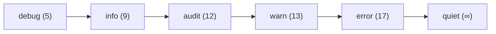

# Quick Guide - OZLogger

Guia rápido de uso do OZLogger com exemplos práticos para os cenários mais comuns.

---

## Índice

- [Instalação](#instalação)
- [Uso Básico](#uso-básico)
- [Níveis de Log](#níveis-de-log)
- [Medição de Tempo](#medição-de-tempo)
- [Contexto e Tracing](#contexto-e-tracing)
- [Dados Sensíveis](#dados-sensíveis)
- [Configuração via Ambiente](#configuração-via-ambiente)
- [Servidor HTTP](#servidor-http)
- [Modo Cluster](#modo-cluster)
- [Receitas Comuns](#receitas-comuns)

---

## Instalação

```bash
# npm
npm install @ozmap/logger

# yarn
yarn add @ozmap/logger

# pnpm
pnpm add @ozmap/logger
```

---

## Uso Básico

### TypeScript

```typescript
import createLogger from '@ozmap/logger';

// Criar logger com tag identificadora
const logger = createLogger('MeuApp');

// Métodos de log disponíveis
logger.debug('Mensagem de debug');
logger.info('Mensagem informativa');
logger.audit('Ação de auditoria');
logger.warn('Aviso importante');
logger.error('Erro encontrado');
```

### JavaScript (CommonJS)

```javascript
const createLogger = require('@ozmap/logger');

const logger = createLogger('MeuApp');

logger.info('Aplicação iniciada');
```

### JavaScript (ESM)

```javascript
import createLogger from '@ozmap/logger';

const logger = createLogger('MeuApp');

logger.info('Aplicação iniciada');
```

---

## Níveis de Log

Os níveis seguem hierarquia de severidade. Configurar um nível habilita todos os níveis superiores:



### Exemplos por Nível

```typescript
import createLogger from '@ozmap/logger';

const logger = createLogger('App');

// DEBUG - Informações detalhadas para desenvolvimento
logger.debug('Query executada', { sql: 'SELECT * FROM users', time: '15ms' });

// INFO - Eventos normais do sistema
logger.info('Servidor iniciado na porta 3000');

// AUDIT - Ações que precisam ser rastreadas
logger.audit('Usuário logou', { userId: 123, ip: '192.168.1.1' });

// WARN - Situações potencialmente problemáticas
logger.warn('Cache miss para chave', { key: 'user:123' });

// ERROR - Erros que precisam de atenção
logger.error('Falha na conexão com banco', new Error('Connection timeout'));
```

### Configurar Nível Mínimo

```bash
# Via variável de ambiente
OZLOGGER_LEVEL=debug node app.js

# Níveis disponíveis: debug, info, audit, warn, error, quiet
```

```typescript
// Via código (runtime)
logger.changeLevel('debug');
```

---

## Medição de Tempo

### Básico

```typescript
import createLogger from '@ozmap/logger';

const logger = createLogger('App');

// Iniciar timer
logger.time('operacao-db');

// ... código da operação ...
await database.query('SELECT * FROM users');

// Finalizar e logar tempo (nível INFO)
logger.timeEnd('operacao-db');
// Output: operacao-db: 125 ms
```

### Com Nível Específico

```typescript
// Timer com nível DEBUG
logger.time('debug-timer');
// ... operação ...
logger.debug.timeEnd('debug-timer');

// Timer com nível ERROR (para operações críticas)
logger.time('critical-operation');
// ... operação ...
logger.error.timeEnd('critical-operation');
```

### Múltiplos Timers

```typescript
logger.time('total');
logger.time('fetch');

const data = await fetch(url);
logger.info.timeEnd('fetch');

logger.time('process');
const result = processData(data);
logger.info.timeEnd('process');

logger.info.timeEnd('total');
```

---

## Contexto e Tracing

### Adicionar Contexto Manual

```typescript
import createLogger from '@ozmap/logger';

const logger = createLogger('API');

// Adicionar contexto que será incluído em todos os logs
logger.withContext({
    requestId: 'req-abc-123',
    userId: 456,
    service: 'user-service'
});

logger.info('Processando requisição');
// Output inclui: requestId, userId, service
```

### Integração com OpenTelemetry

```typescript
import createLogger from '@ozmap/logger';
import { trace, context } from '@opentelemetry/api';

const logger = createLogger('App');
const tracer = trace.getTracer('my-app');

// Criar span
const span = tracer.startSpan('operacao');

context.with(trace.setSpan(context.active(), span), () => {
    // traceId e spanId são adicionados automaticamente
    logger.info('Operação em andamento');
    
    span.end();
});
```

### Exemplo Express com Tracing

```typescript
import express from 'express';
import createLogger from '@ozmap/logger';
import { randomUUID } from 'crypto';

const app = express();
const logger = createLogger('API');

// Middleware para adicionar requestId
app.use((req, res, next) => {
    const requestId = req.headers['x-request-id'] || randomUUID();
    
    // Criar logger com contexto da requisição
    req.logger = createLogger('API', { noServer: true });
    req.logger.withContext({
        requestId,
        method: req.method,
        path: req.path
    });
    
    next();
});

app.get('/users/:id', async (req, res) => {
    req.logger.info('Buscando usuário');
    
    try {
        const user = await findUser(req.params.id);
        req.logger.audit('Usuário encontrado', { userId: req.params.id });
        res.json(user);
    } catch (error) {
        req.logger.error('Erro ao buscar usuário', error);
        res.status(500).json({ error: 'Internal error' });
    }
});
```

---

## Dados Sensíveis

### mask() - Ofuscar Valores

```typescript
import { mask } from '@ozmap/logger';

const userData = {
    name: 'João Silva',
    email: 'joao@email.com',
    password: 'senha123',
    creditCard: '1234-5678-9012-3456',
    address: {
        street: 'Rua Principal',
        cpf: '123.456.789-00'
    }
};

// Ofuscar campos sensíveis
const safeData = mask(userData, ['password', 'creditCard', 'cpf']);

console.log(safeData);
// {
//   name: 'João Silva',
//   email: 'joao@email.com',
//   password: '****************************************',
//   creditCard: '****************************************',
//   address: {
//     street: 'Rua Principal',
//     cpf: '****************************************'
//   }
// }
```

### filter() - Remover Campos

```typescript
import { filter } from '@ozmap/logger';

const userData = {
    name: 'João Silva',
    email: 'joao@email.com',
    password: 'senha123',
    token: 'jwt-token-here'
};

// Remover campos completamente
const safeData = filter(userData, ['password', 'token']);

console.log(safeData);
// {
//   name: 'João Silva',
//   email: 'joao@email.com'
// }
```

### Uso Combinado

```typescript
import createLogger, { mask, filter } from '@ozmap/logger';

const logger = createLogger('Auth');

function logUserAction(user: User, action: string) {
    // Primeiro filtrar campos desnecessários
    const filtered = filter(user, ['internalId', 'sessionData']);
    
    // Depois mascarar campos sensíveis
    const safe = mask(filtered, ['password', 'cpf', 'creditCard']);
    
    logger.audit(action, { user: safe });
}
```

---

## Configuração via Ambiente

### Variáveis Disponíveis

```bash
# Nível mínimo de log
OZLOGGER_LEVEL=audit      # debug, info, audit, warn, error, quiet

# Formato de saída
OZLOGGER_OUTPUT=json      # json (produção) ou text (desenvolvimento)

# Colorização (apenas para text)
OZLOGGER_COLORS=false     # true ou false

# Incluir timestamp
OZLOGGER_DATETIME=true    # true ou false

# Servidor HTTP
OZLOGGER_HTTP=true        # true ou false
OZLOGGER_SERVER=9898      # porta ou host:porta
```

### Configuração para Desenvolvimento

```bash
# .env.development
OZLOGGER_LEVEL=debug
OZLOGGER_OUTPUT=text
OZLOGGER_COLORS=true
OZLOGGER_DATETIME=true
```

### Configuração para Produção

```bash
# .env.production
OZLOGGER_LEVEL=audit
OZLOGGER_OUTPUT=json
OZLOGGER_COLORS=false
OZLOGGER_DATETIME=true
OZLOGGER_HTTP=true
```

### Configuração para Testes

```bash
# .env.test
OZLOGGER_LEVEL=quiet
OZLOGGER_HTTP=false
```

---

## Servidor HTTP

### Alterar Nível em Runtime

```bash
# Mudar para debug por 5 minutos (300000ms)
curl -X POST http://localhost:9898/changeLevel \
  -H "Content-Type: application/json" \
  -d '{"level": "debug", "duration": 300000}'
```

### Script de Diagnóstico

```bash
#!/bin/bash
# enable-debug.sh

HOST=${1:-localhost}
PORT=${2:-9898}
DURATION=${3:-300000}

curl -X POST "http://${HOST}:${PORT}/changeLevel" \
  -H "Content-Type: application/json" \
  -d "{\"level\": \"debug\", \"duration\": ${DURATION}}"

echo "Debug habilitado por ${DURATION}ms"
```

### Desabilitar Servidor

```typescript
// Via código
const logger = createLogger('App', { noServer: true });

// Via ambiente
// OZLOGGER_HTTP=false
```

---

## Modo Cluster

```typescript
import cluster from 'cluster';
import { cpus } from 'os';
import createLogger from '@ozmap/logger';

const logger = createLogger('App');

if (cluster.isPrimary) {
    logger.info(`Primary ${process.pid} iniciando`);
    
    // Servidor HTTP só inicia no primary
    // Workers recebem comandos via IPC
    
    for (let i = 0; i < cpus().length; i++) {
        cluster.fork();
    }
    
    cluster.on('exit', (worker) => {
        logger.warn(`Worker ${worker.process.pid} morreu`);
    });
} else {
    // Workers não iniciam servidor HTTP
    const workerLogger = createLogger('Worker', { noServer: true });
    
    workerLogger.info(`Worker ${process.pid} iniciado`);
    
    // Aplicação do worker...
}
```

---

## Receitas Comuns

### Logger por Módulo

```typescript
// src/logger.ts
import createLogger from '@ozmap/logger';

export const logger = createLogger('App');
export const dbLogger = createLogger('Database', { noServer: true });
export const apiLogger = createLogger('API', { noServer: true });
export const authLogger = createLogger('Auth', { noServer: true });
```

```typescript
// src/database.ts
import { dbLogger } from './logger';

export async function query(sql: string) {
    dbLogger.time('query');
    const result = await db.execute(sql);
    dbLogger.debug.timeEnd('query');
    return result;
}
```

### Logging de Erros HTTP

```typescript
import createLogger from '@ozmap/logger';
import express from 'express';

const app = express();
const logger = createLogger('API');

// Error handler
app.use((err, req, res, next) => {
    const errorId = randomUUID();
    
    logger.error('Erro na requisição', {
        errorId,
        method: req.method,
        path: req.path,
        error: err.message,
        stack: err.stack
    });
    
    res.status(500).json({
        error: 'Internal Server Error',
        errorId // Para correlação com logs
    });
});
```

### Logging de Performance

```typescript
import createLogger from '@ozmap/logger';

const logger = createLogger('Perf');

async function withTiming<T>(
    name: string,
    fn: () => Promise<T>
): Promise<T> {
    logger.time(name);
    try {
        const result = await fn();
        logger.info.timeEnd(name);
        return result;
    } catch (error) {
        logger.error.timeEnd(name);
        throw error;
    }
}

// Uso
const users = await withTiming('fetchUsers', () => 
    database.query('SELECT * FROM users')
);
```

### Logging Estruturado para ELK

```typescript
import createLogger from '@ozmap/logger';

const logger = createLogger('App');

// Logs já saem no formato correto para ELK
logger.info('Evento', {
    event_type: 'user_action',
    user_id: 123,
    action: 'login',
    metadata: {
        ip: '192.168.1.1',
        user_agent: 'Mozilla/5.0...'
    }
});

// Output JSON:
// {
//   "timestamp": "2024-01-15T10:30:00.000Z",
//   "tag": "App",
//   "severityText": "INFO",
//   "severityNumber": 9,
//   "body": {
//     "0": "Evento",
//     "1": { "event_type": "user_action", ... }
//   },
//   "traceId": "...",
//   "spanId": "...",
//   "pid": 12345
// }
```

### Logging para Auditoria/Compliance

```typescript
import createLogger, { mask } from '@ozmap/logger';

const logger = createLogger('Audit');

function auditUserAction(
    action: string,
    user: User,
    details: Record<string, unknown>
) {
    logger.audit(action, {
        timestamp: new Date().toISOString(),
        actor: {
            id: user.id,
            email: mask({ email: user.email }, ['email']).email,
            role: user.role
        },
        action,
        details,
        compliance: {
            gdpr: true,
            retention_days: 365
        }
    });
}

// Uso
auditUserAction('DATA_EXPORT', currentUser, {
    exported_records: 150,
    format: 'CSV'
});
```

---

## Troubleshooting

### Porta 9898 em uso

```typescript
// Usar porta diferente
process.env.OZLOGGER_SERVER = '9999';

// Ou desabilitar servidor
const logger = createLogger('App', { noServer: true });
```

### Logs não aparecem

```bash
# Verificar nível configurado
echo $OZLOGGER_LEVEL

# Se for 'quiet', nada será exibido
# Mudar para 'debug' para ver tudo
OZLOGGER_LEVEL=debug node app.js
```

### Caracteres estranhos no log

```bash
# Desabilitar cores se terminal não suporta
OZLOGGER_COLORS=false node app.js
```

### Memória alta em testes

```bash
# Desabilitar servidor HTTP em testes
OZLOGGER_HTTP=false npm test
```

---

## Referências

- [Documentação Completa](../README.md)
- [Arquitetura](./ARCHITECTURE.md)
- [Problemas Conhecidos](./ISSUES.md)
- [OpenTelemetry Data Model](https://opentelemetry.io/docs/specs/otel/logs/data-model/)
