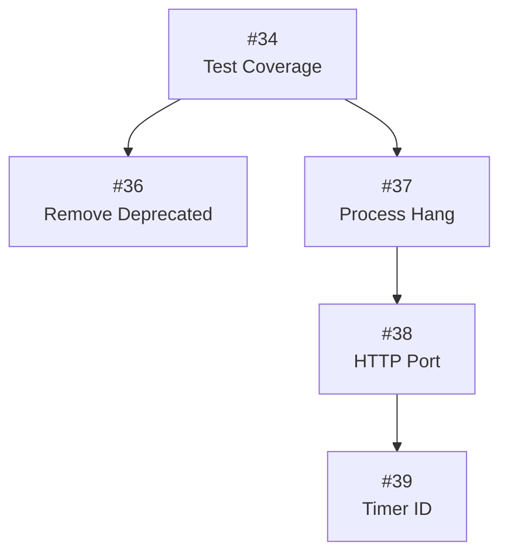

# Tasks - OZLogger

Este diretório contém todas as tasks de desenvolvimento do OZLogger.

## Estrutura de Tasks

Cada task segue a estrutura:
- `Task.md` - Descrição da tarefa, objetivo, critérios de aceitação
- `Context.md` - Contexto técnico: arquivos afetados, código relevante
- `Progress.md` - Histórico de progresso, checklist, status atual
- `Summary.md` - Resumo executivo: impacto, prioridade, decisões

## Tasks Ativas

| ID | GitHub | Título | Prioridade | Status |
|----|--------|--------|------------|--------|
| [034](task-034-test-coverage/) | [#34](https://github.com/ozmap/ozlogger/issues/34) | Expandir Cobertura de Testes | 🔴 Crítico | Não Iniciado |
| [036](task-036-remove-deprecated/) | [#36](https://github.com/ozmap/ozlogger/issues/36) | Remover Deprecados | 🟡 Médio | Planejado v0.3.x |
| [037](task-037-process-hang-fix/) | [#37](https://github.com/ozmap/ozlogger/issues/37) | Corrigir Process Hang | 🔴 Crítico | Não Iniciado |
| [038](task-038-http-port-conflict/) | [#38](https://github.com/ozmap/ozlogger/issues/38) | Conflito de Porta HTTP | 🔴 Alta | Workaround |
| [039](task-039-timer-id-duplicate/) | [#39](https://github.com/ozmap/ozlogger/issues/39) | Timer ID Duplicado | 🔴 Alta | Workaround |

## Prioridades

| Emoji | Nível | Descrição |
|-------|-------|-----------|
| 🔴 | Crítico | Bloqueia deploy ou causa bugs em produção |
| 🟠 | Alto | Importante para próxima release |
| 🟡 | Médio | Melhoria desejável |
| 🟢 | Baixo | Nice to have |
| ⚪ | Backlog | Futuro indefinido |

## Dependências

## Como Criar Nova Task

1. Criar issue no GitHub: `gh issue create --repo ozmap/ozlogger`
2. Criar pasta `task-NNN-nome-curto/` onde NNN é o número da issue
3. Criar os 4 arquivos obrigatórios
4. Atualizar esta tabela
5. Vincular ao IMPROVEMENTS.md ou ISSUES.md se aplicável
