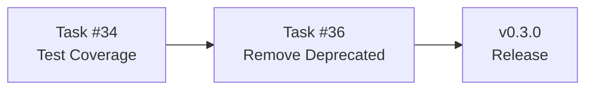

# Resumo Executivo - Task #36

## Visão Geral

| Campo | Valor |
|-------|-------|
| **ID** | task-036 |
| **GitHub** | [#36](https://github.com/ozmap/ozlogger/issues/36) |
| **Título** | Remover Campos e Métodos Deprecados |
| **Prioridade** | 🟡 Médio |
| **Status** | Planejado para v0.3.x |
| **Estimativa** | 1-2 dias |
| **Assignee** | - |
| **Breaking Change** | ⚠️ Sim |

## Impacto

### Benefícios
- ✅ Redução de ~15% no tamanho do código
- ✅ API pública mais limpa
- ✅ Menos confusão para novos usuários
- ✅ Manutenção simplificada

### Riscos
- ⚠️ Breaking change para usuários de métodos deprecados
- ⚠️ Parsers de log que dependem de campos legados

## Itens a Remover

| Categoria | Item | Substituto |
|-----------|------|------------|
| Método | `silly()` | `debug()` |
| Método | `http()` | `info()` |
| Método | `critical()` | `error()` |
| Método | `tag()` | `createLogger(tag)` |
| Método | `Logger.init()` | `createLogger()` |
| Campo JSON | `data` | `body` |
| Campo JSON | `level` | `severityText` |
| Nível | `silly` | - |
| Nível | `http` | - |
| Nível | `critical` | - |

## Dependências

## Decisões Tomadas

1. **Versão:** Lançar na v0.3.0 (minor bump com breaking)
2. **Migração:** Documentar guia de migração no README
3. **Timeline:** Após cobertura de testes atingir 80%

## Links Relacionados

- [IMPROVEMENTS.md](../../IMPROVEMENTS.md) - Item #2
- [LogLevels.ts](../../../lib/util/enum/LogLevels.ts)
- [Task #34](../task-034-test-coverage/)
