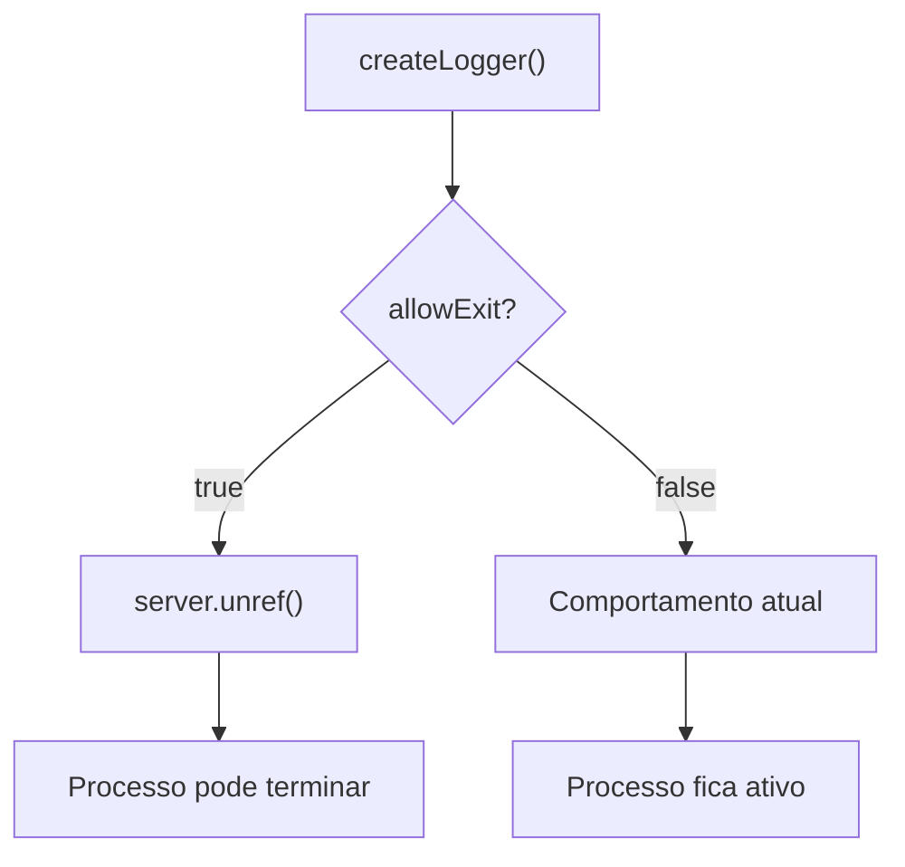

# Resumo Executivo - Task #37

## Visão Geral

| Campo | Valor |
|-------|-------|
| **ID** | task-037 |
| **GitHub** | [#37](https://github.com/ozmap/ozlogger/issues/37) |
| **Título** | Corrigir Process Hang |
| **Prioridade** | 🔴 Crítico |
| **Status** | ✅ Concluído |
| **Estimativa** | 1-2 dias |
| **Assignee** | - |
| **Breaking Change** | Não |

## Problema

O processo Node.js não termina quando OZLogger está ativo devido a:
- Servidor HTTP escutando
- Event listeners IPC ativos

## Impacto

### Afetados
- ❌ Scripts CLI que devem terminar
- ❌ Testes Jest que ficam pendurados
- ❌ Lambda/Serverless

### Não Afetados
- ✅ Aplicações web (comportamento esperado)
- ✅ Servidores long-running

## Solução Proposta



### API Nova

```typescript
// Opção de configuração
const logger = createLogger('cli', { allowExit: true });

// Shutdown explícito
await logger.shutdown();
```

## Métricas de Sucesso

| Métrica | Antes | Depois |
|---------|-------|--------|
| Script termina | ❌ Não | ✅ Sim |
| Jest hang | ❌ Sim | ✅ Não |
| Breaking change | - | ❌ Não |

## Decisões Tomadas

1. **Abordagem:** `server.unref()` + opção `allowExit`
2. **Default:** Manter comportamento atual (backward compat)
3. **Método adicional:** `shutdown()` para cleanup explícito

## Links Relacionados

- [ANALYSIS-PROCESS-HANG.md](../../ANALYSIS-PROCESS-HANG.md)
- [ISSUES.md](../../ISSUES.md)
- [lib/http/server.ts](../../../lib/http/server.ts)
