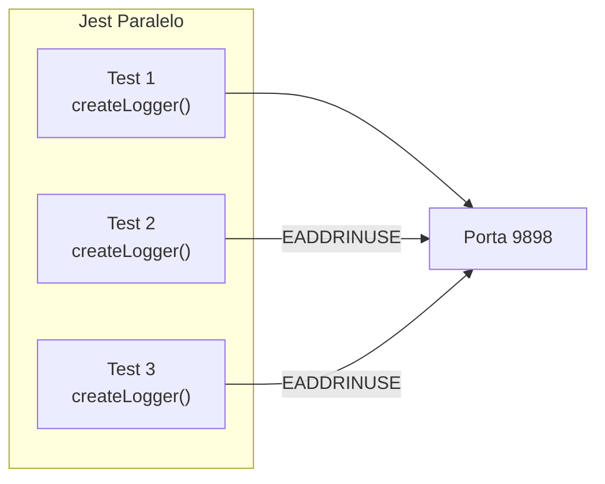

# Contexto Técnico - Task #38

## Causa Raiz

### Código Problemático

```typescript
// lib/http/server.ts
const server = http.createServer(handleRequest);
server.listen(port, host); // Porta fixa = conflito
```

### Cenário de Conflito



## Arquivos Afetados

- `lib/http/server.ts` - Lógica de binding de porta
- `lib/Logger.ts` - Opção noServer
- `tests/*.test.ts` - Configuração de testes

## Soluções

### 1. Porta Dinâmica (port 0)

```typescript
// lib/http/server.ts
const port = options?.port ?? parseInt(env.OZLOGGER_SERVER || '0');
server.listen(port, host, () => {
    const actualPort = (server.address() as AddressInfo).port;
    console.log(`OZLogger HTTP on port ${actualPort}`);
});
```

### 2. Singleton Global

```typescript
// lib/http/server.ts
let globalServer: Server | null = null;

export function startServer() {
    if (globalServer) return globalServer;
    globalServer = http.createServer(handleRequest);
    // ...
}
```

### 3. Test Utilities

```typescript
// lib/testing.ts
export function createTestLogger(tag: string) {
    return createLogger(tag, { noServer: true });
}
```

## Configuração Jest Recomendada

```javascript
// jest.config.js
module.exports = {
    // Rodar testes serialmente
    maxWorkers: 1,
    // Ou usar setupFiles
    setupFiles: ['./tests/setup.ts']
};
```

```typescript
// tests/setup.ts
process.env.OZLOGGER_HTTP = 'false';
```

## Testes

```typescript
describe('Port Conflict', () => {
    test('multiple loggers should not conflict', () => {
        const logger1 = createLogger('test1', { noServer: true });
        const logger2 = createLogger('test2', { noServer: true });
        // Não deve lançar exceção
    });
    
    test('dynamic port should be assigned', () => {
        process.env.OZLOGGER_SERVER = '0';
        const logger = createLogger('dynamic');
        // Porta deve ser > 0
    });
});
```

## Links

- [ISSUES.md](../../ISSUES.md) - Issue #1
- [lib/http/server.ts](../../../lib/http/server.ts)
