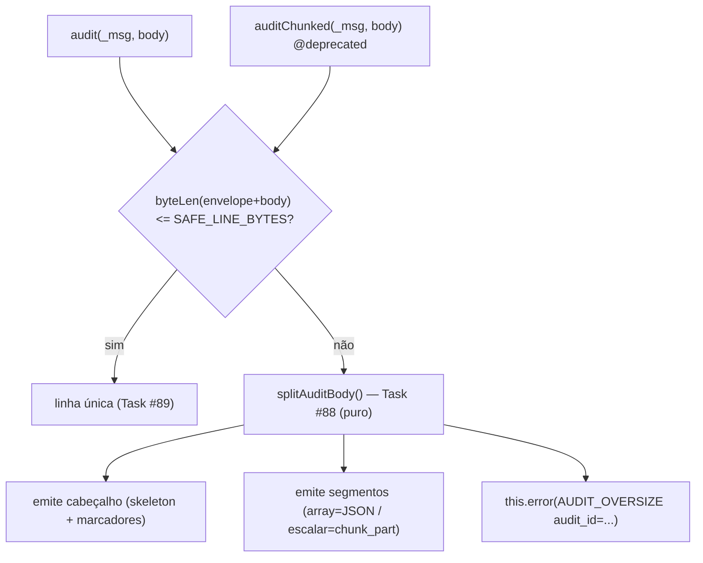

# Contexto Técnico - Task #90

## Arquitetura



> **Mesma contingência, dois pontos de entrada.** A RFC (§9) afirma: "O `audit()`
> padrão aplica a mesma contingência internamente". `auditChunked()` apenas a
> torna **explícita, nomeada e `@deprecated`** para facilitar localização/remoção.

## O que muda em `lib/Logger.ts`

### Branch de oversize (linhas ~296-301) — hoje **descarta**

```ts
// HOJE: descarta silenciosamente
if (size > DEFAULT_AUDIT_MAX_BYTES) {
  this.error(`... exceeds the safe limit ...; record dropped`);
  return;
}
```

Passa a: mintar `audit_id`, chamar `splitAuditBody(body, { auditId, limit: SAFE_LINE_BYTES })`,
emitir cabeçalho + segmentos (cada um com o envelope de auditoria da Task #89), e
emitir o ERROR `AUDIT_OVERSIZE`. Gatilho passa a ser `SAFE_LINE_BYTES` (~200 KB),
não os 256 KB.

### Emissão das linhas de quebra (sem `body.0`)

Cada linha (cabeçalho/segmento) é um registro de auditoria **já montado**. A
emissão **não** pode passar pelo `push()`/`data[i++]` do `json.ts` (reintroduziria
`body.0`). Recomendado: reusar o mesmo caminho de emissão de auditoria definido na
Task #89 (que atribui `body` inteiro e monta o envelope), passando cada linha
pronta. Combinar o mecanismo exato com a Task #89 (decisão "arquitetura de emissão").

### `auditChunked()` — RFC §9 (adaptado)

A RFC mostra uma função livre amarrada a um `logger` de módulo, chamando
`logger.audit(_msg, body)` no caminho de "coube". Atenção: o `audit()` novo exige
aridade 2 — `auditChunked` **não** deve depender de detalhes de aridade; deve
produzir o **mesmo envelope** de `audit('m', body)`. Recomendado expor como
**método do `Logger`** (`this.error`, `this.tag`, caminho de emissão de auditoria
já disponíveis), marcado `@deprecated`.

```ts
/**
 * @deprecated Contingência temporária para a ferramenta de importação.
 * Não é um recurso. Quebra um corpo grande em linhas de até ~200KB para evitar
 * perda silenciosa no Victoria Logs, sempre emitindo um ERROR com o audit_id.
 * Remover quando a importação passar a auditar por intenção (§7).
 */
public auditChunked(_msg: string, body: Record<string, unknown>): void { /* usa splitAuditBody + ERROR */ }
```

## ERROR `AUDIT_OVERSIZE` (§8)

```text
ERROR AUDIT_OVERSIZE audit_id=01J8Z9K3F7AB... : o registro excedeu 256KB e precisou
      ser quebrado em 34 partes. Esta é uma medida de contingência, não um recurso;
      reduza o volume na origem (auditar a intenção). Consulte a §7.
```

- nível ERROR (vai ao fluxo operacional → SigNoz, tratado como alerta);
- contém literal `AUDIT_OVERSIZE`, `audit_id=<id>`, contagem de partes, referência à §7;
- casa com a consulta §11d.

## Linhas de quebra (§8.1) — formato

```jsonc
// cabeçalho
{ "_time":"...", "level":"AUDIT", "severityText":"AUDIT", "severityNumber":12,
  "tag":"reports", "audit_id":"01J8Z9...", "chunked":true, "chunk_total":34,
  "_msg":"report.generate",
  "body": { "action":"report.generate", "user":"alice",
            "result_csv": { "ref":"body.result_csv", "type":"string", "bytes":5242880, "sha1":"ab12..." } } }

// segmento — array (consultável por json_array_contains_any)
{ "...envelope...":"...", "audit_id":"01J8Z9...", "chunk_seq":3, "chunk_total":34,
  "chunk_field":"body.affected_ids", "body": { "affected_ids": ["64f8...e09","..."] } }

// segmento — escalar/blob (reconstruído por concatenação)
{ "...envelope...":"...", "audit_id":"01J8Z9...", "chunk_seq":7, "chunk_total":34,
  "chunk_field":"body.result_csv", "chunk_part":"<fração de ~150KB>" }
```

> Semântica de `chunk_total`/`chunk_seq`: **global** (ver Task #88, resolução da
> ambiguidade §8.1 × §9).

## Testes — `tests/audit.test.ts` (+ casos novos)

- O teste de oversize atual (linhas ~88-98) deixa de esperar "descarte" e passa a
  esperar **cabeçalho + segmentos + 1 ERROR**.
- Casos: marcador `{ref,type,bytes,sha1}` no cabeçalho; segmento array vs escalar;
  `chunk_seq`/`chunk_total`/`chunk_field`; correlação por `audit_id`; ERROR
  `AUDIT_OVERSIZE`; estouro por nº de campos; caminho "coube" de `auditChunked`
  (linha única, sem `chunk_*`, sem ERROR); reconstrução por `chunk_field`.

## Referências

- RFC §8, §8.1, §9, §13 (observabilidade: o ERROR é o principal indicador; integridade verifica `chunk_total`).
- §8.2 (pasta local): **estudo, não adotada** — não implementar.
- Task #88 (`splitAuditBody`, `auditId`, `SAFE_LINE_BYTES`); Task #89 (envelope de auditoria).
